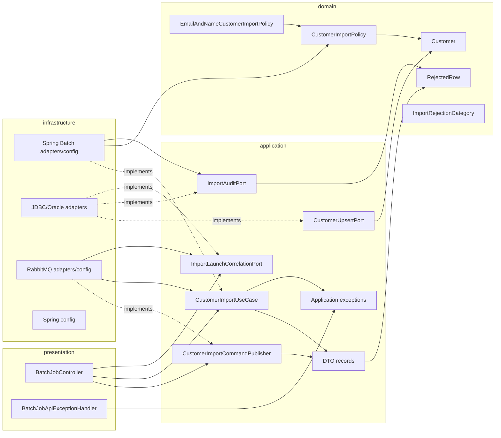
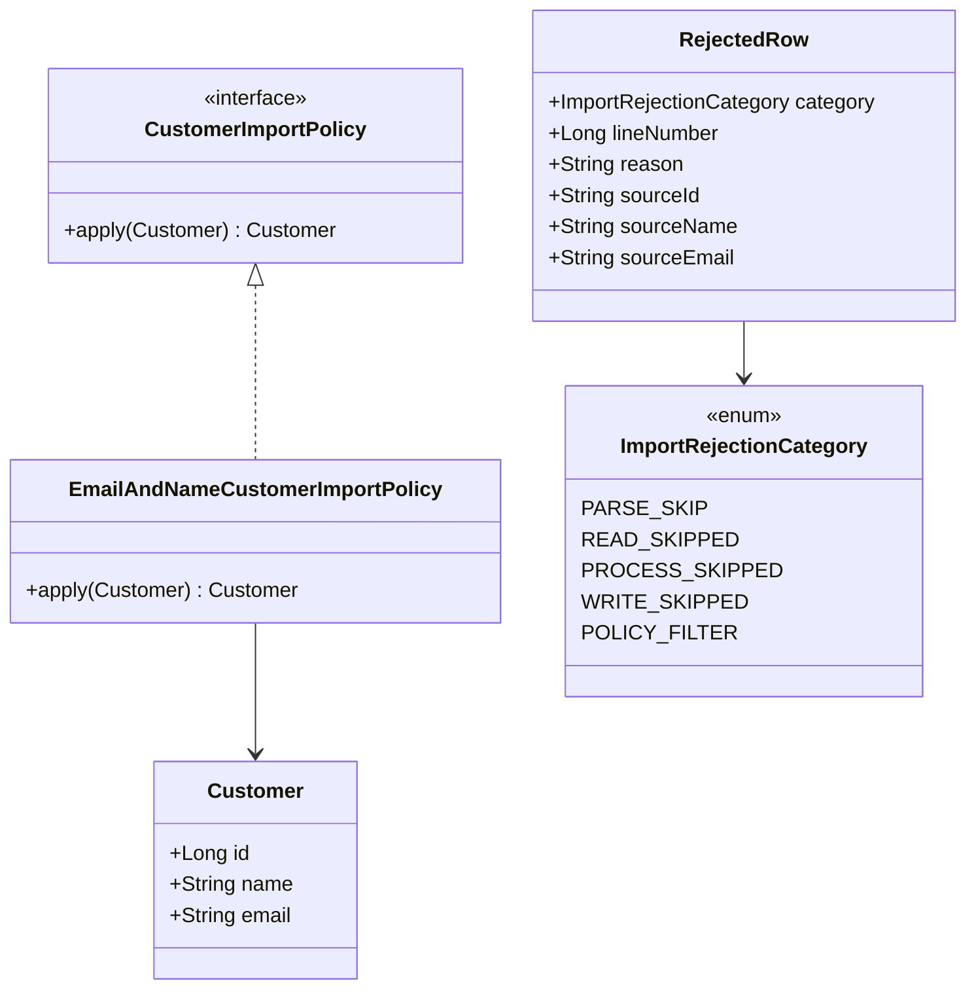
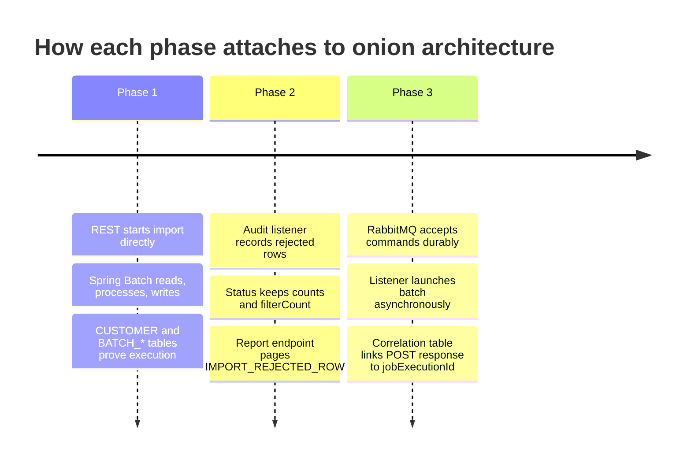
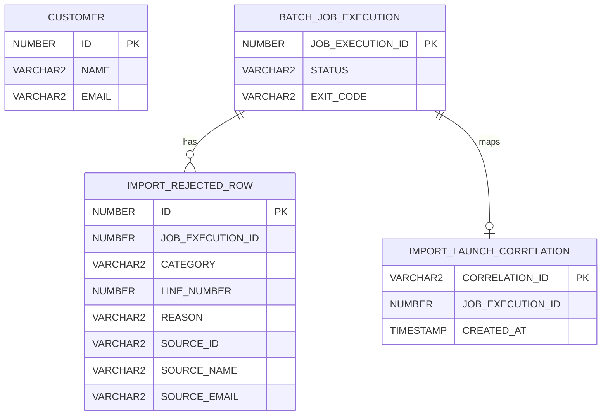

# Onion architecture

Spring Batch customer import is split so business rules and use-case contracts stay inside, while REST, Batch, JDBC, Oracle, and RabbitMQ stay outside.

This deck is the architecture map for all phases:

- root package stays `com.example.spring_batch_demo`
- dependencies point inward
- domain/application stay free of Spring Batch, JDBC, AMQP, and controller types
- infrastructure and presentation adapt the outside world to application ports

---

# What this deck explains

| Topic | Answer |
|-------|--------|
| Layering | which package owns which responsibility |
| Dependency rule | what is allowed to import what |
| Ports | which interfaces define use-case boundaries |
| Adapters | where Spring MVC, Spring Batch, RabbitMQ, JDBC, and Oracle live |
| Phase fit | how Phase 1, Phase 2, and Phase 3 attach without changing domain rules |

---

# Layer map

Rule: arrows from outside layers may point inward; inward layers must not point back out.

---

# Package responsibilities

| Package | Role | Examples |
|---------|------|----------|
| `domain/customer` | business model and import policy | `Customer`, `CustomerImportPolicy`, `EmailAndNameCustomerImportPolicy` |
| `domain/importaudit` | audit concepts, not persistence | `RejectedRow`, `ImportRejectionCategory` |
| `application/customer` | use-case inputs, DTOs, exceptions, ports | `CustomerImportUseCase`, `CustomerImportResult`, `ImportAuditPort` |
| `presentation/api` | HTTP endpoints and HTTP error mapping | `BatchJobController`, `BatchJobApiExceptionHandler` |
| `infrastructure/adapter/batch` | Spring Batch adapter implementations | processor, writer, listener, use-case adapter |
| `infrastructure/adapter/persistence` | JDBC and Oracle details | customer upsert, audit insert/query, correlation lookup |
| `infrastructure/adapter/messaging` | RabbitMQ adapter implementations | AMQP publisher, listener, direct fallback publisher |
| `infrastructure/config` | Spring wiring | async launcher, domain policy, JDBC, RabbitMQ |

---

# Dependency rule by layer

| Layer | May depend on | Must not depend on |
|-------|---------------|--------------------|
| Domain | Java only, domain package siblings | Spring, JDBC, Batch, AMQP, REST, application DTOs |
| Application | domain and application exceptions/DTOs/ports | Spring MVC, Spring Batch, JDBC, RabbitMQ |
| Presentation | application ports, DTOs, exceptions | infrastructure implementations |
| Infrastructure | application ports, domain models, Spring/JDBC/Batch/AMQP | presentation controllers |

The application layer defines what the system can do. Infrastructure decides how it is done.

---

# Application ports

```mermaid
classDiagram
  class CustomerImportUseCase {
    <<port>>
    +launchImport(inputFile) Long
    +getImportStatus(jobExecutionId) CustomerImportResult
    +getImportAuditReport(jobExecutionId, limit, offset) ImportAuditReport
  }

  class CustomerImportCommandPublisher {
    <<port>>
    +publish(CustomerImportCommand) CustomerImportEnqueueResponse
  }

  class CustomerUpsertPort {
    <<port>>
    +upsert(Customer)
  }

  class ImportAuditPort {
    <<port>>
    +recordRejected(jobExecutionId, RejectedRow)
    +countRejected(jobExecutionId) long
    +loadRows(jobExecutionId, limit, offset) List~RejectedRow~
  }

  class ImportLaunchCorrelationPort {
    <<port>>
    +registerLaunchedJob(correlationId, jobExecutionId)
    +findJobExecutionId(correlationId) OptionalLong
  }
```

Ports are stable seams. Each phase adds behavior by adding or replacing adapters around these ports.

---

# Adapter map

```mermaid
flowchart TB
  subgraph ports["Application ports"]
    PUB[CustomerImportCommandPublisher]
    UC[CustomerImportUseCase]
    UP[CustomerUpsertPort]
    AUD[ImportAuditPort]
    CORR[ImportLaunchCorrelationPort]
  end

  subgraph adapters["Infrastructure adapters"]
    DIRECT[DirectCustomerImportCommandPublisher]
    AMQP[AmqpCustomerImportCommandPublisher]
    LISTENER[CustomerImportJobLaunchListener]
    BATCH[SpringBatchCustomerImportUseCase]
    WRITER[CustomerUpsertItemWriterAdapter]
    ORACLE[OracleCustomerUpsertPortAdapter]
    AUDJDBC[JdbcImportAuditPortAdapter]
    CORRJDBC[JdbcImportLaunchCorrelationAdapter]
    NOOP[NoOpCustomerUpsertPortAdapter]
  end

  DIRECT -.-> PUB
  AMQP -.-> PUB
  BATCH -.-> UC
  ORACLE -.-> UP
  NOOP -.-> UP
  AUDJDBC -.-> AUD
  CORRJDBC -.-> CORR
  LISTENER --> UC
  LISTENER --> CORR
  WRITER --> UP
```

Direct and AMQP publishers are selected by `app.messaging.customer-import.enabled`.

---

# Presentation boundary

| HTTP request | Controller method | Application dependency | Response |
|--------------|-------------------|------------------------|----------|
| `POST /api/batch/customer/import?inputFile=...` | `importCustomers` | `CustomerImportCommandPublisher` | `202` with correlation and queue/start status |
| `GET /api/batch/customer/import/by-correlation/{correlationId}/job` | `getJobExecutionIdByCorrelation` | `ImportLaunchCorrelationPort` | `200` with `jobExecutionId`, `404` if not launched |
| `GET /api/batch/customer/import/{jobExecutionId}/status` | `getImportStatus` | `CustomerImportUseCase` | `200`, `404`, or `500` with result |
| `GET /api/batch/customer/import/{jobExecutionId}/report?limit=&offset=` | `getImportAuditReport` | `CustomerImportUseCase` | `200`, `404`, or `500` with report |

The controller does not know whether work is launched by RabbitMQ or directly.

---

# Domain model stays small

The default policy filters rows with missing/invalid email and uppercases valid names.

---

# Phase fit

The domain policy did not need RabbitMQ, Oracle DDL, HTTP status mapping, or Spring Batch listener APIs.

---

# Runtime profiles

| Profile | Messaging | Database | Writer | Purpose |
|---------|-----------|----------|--------|---------|
| default | disabled by default | Oracle config | Oracle MERGE | safer baseline |
| `dev` | RabbitMQ enabled | Oracle XE | Oracle MERGE | full Phase 3 path |
| `audit-it` | RabbitMQ disabled | H2 Oracle mode | no-op customer upsert | fast audit/report smoke |
| `test` | RabbitMQ disabled | H2 Oracle mode | test wiring | automated tests |
| `amqp-it` | RabbitMQ enabled | H2 Oracle mode | no-op customer upsert | AMQP integration path |

Profiles swap infrastructure. The controller and application ports remain stable.

---

# Database ownership by concern

Spring Batch owns `BATCH_*`. The app owns `CUSTOMER`, `IMPORT_REJECTED_ROW`, and `IMPORT_LAUNCH_CORRELATION`.

---

# Keep these boundaries

| If adding... | Put it in... | Reason |
|--------------|--------------|--------|
| new validation rule | domain policy | business rule, no framework needed |
| new REST endpoint | presentation | HTTP concern |
| new use-case shape | application port/DTO | contract between outside and inside |
| new DB query | infrastructure persistence adapter | JDBC/SQL concern |
| new Batch listener | infrastructure batch adapter | Spring Batch lifecycle concern |
| new broker or queue | infrastructure messaging adapter/config | transport concern |

If a class imports `org.springframework.batch`, `org.springframework.jdbc`, or `org.springframework.amqp`, it is not domain/application code.

---

# Presenter file map

| Topic | File |
|-------|------|
| REST entry points | `presentation/api/BatchJobController.java` |
| HTTP error mapping | `presentation/api/exceptions/BatchJobApiExceptionHandler.java` |
| Use-case contract | `application/customer/port/CustomerImportUseCase.java` |
| Command publisher port | `application/customer/port/CustomerImportCommandPublisher.java` |
| Domain policy | `domain/customer/policy/EmailAndNameCustomerImportPolicy.java` |
| Spring Batch adapter | `infrastructure/adapter/batch/SpringBatchCustomerImportUseCase.java` |
| Job/step wiring | `infrastructure/config/batch/CustomerImportJobConfig.java` |
| RabbitMQ topology | `infrastructure/config/messaging/CustomerImportRabbitConfig.java` |
| DB schema | `src/main/resources/schema.sql` |

---

# Architecture takeaway

The successful flow is not one large controller-to-database script.

It is a chain of adapters around stable application ports:

1. REST accepts and validates request shape.
2. Application ports describe import, status, report, publish, audit, and correlation behavior.
3. Infrastructure launches Spring Batch, reads CSV, writes Oracle/H2, records audit, and handles RabbitMQ.
4. Domain policy makes the row-level business decision.
