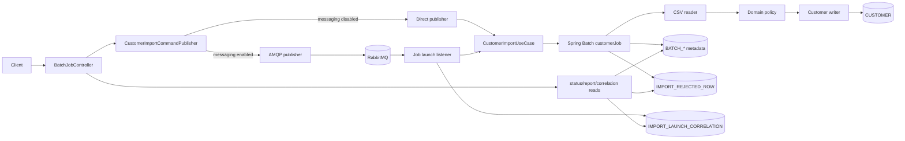
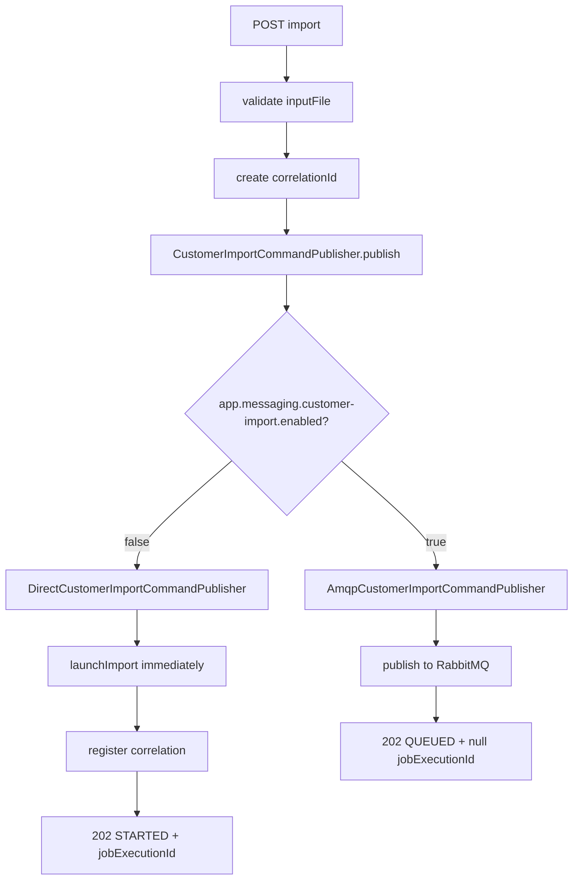
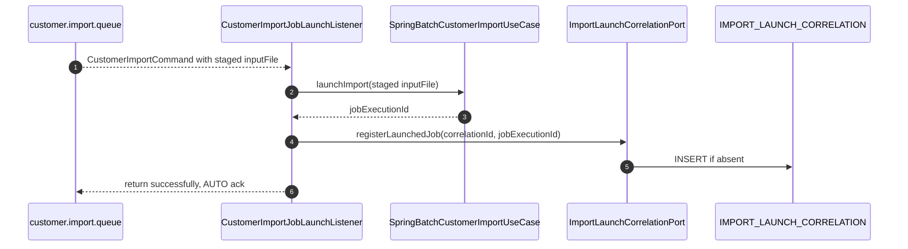
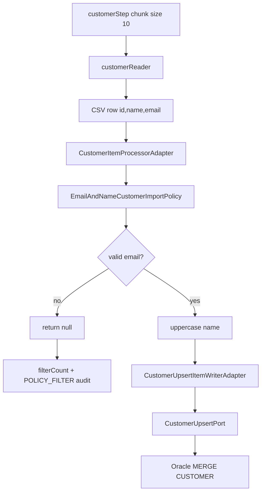
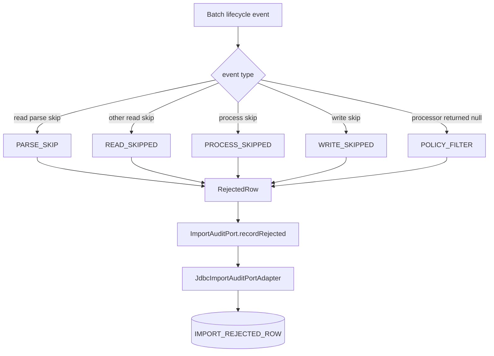
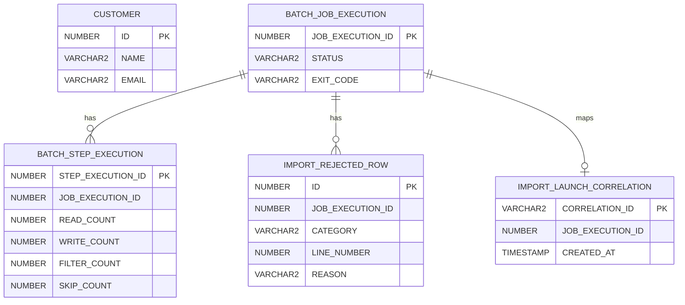
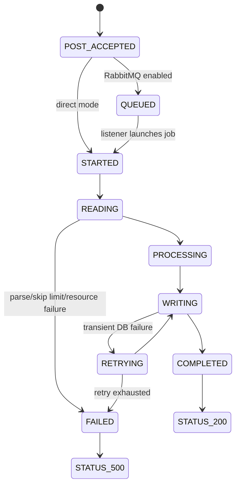

# Overall flows

This deck ties all phases together:

- onion architecture boundaries
- all HTTP endpoints
- direct and RabbitMQ POST branches
- batch read/process/write flow
- audit/report flow
- correlation lookup flow
- DB tables and response rules
- where the successful flow goes next

---

# One-page runtime map



---

# Endpoint inventory

| Endpoint | Purpose | Success |
|----------|---------|---------|
| `POST /api/batch/customer/import?inputFile=...` | accept import request | `202` with `CustomerImportEnqueueResponse` |
| `GET /api/batch/customer/import/by-correlation/{correlationId}/job` | resolve queued request to `jobExecutionId` | `200` with `{"jobExecutionId": ...}` |
| `GET /api/batch/customer/import/{jobExecutionId}/status` | read batch progress and rejected sample | `200` with `CustomerImportResult` |
| `GET /api/batch/customer/import/{jobExecutionId}/report?limit=&offset=` | read paginated rejected rows | `200` with `ImportAuditReport` |

---

# POST branch selector



The client decides next action from `status` and `jobExecutionId`.

---

# POST responses

Direct mode:

```json
{
  "correlationId": "2f8f4f22-4c87-48e4-9de9-e53c4f4fe19d",
  "status": "STARTED",
  "jobExecutionId": 41
}
```

RabbitMQ mode:

```json
{
  "correlationId": "2f8f4f22-4c87-48e4-9de9-e53c4f4fe19d",
  "status": "QUEUED",
  "jobExecutionId": null
}
```

---

# RabbitMQ listener chain



If listener throws repeatedly, retry exhausts and RabbitMQ dead-letters the message.

---

# Batch launch method chain

```mermaid
flowchart LR
  A[launchImport(inputFile)] --> B[CustomerImportInputFile.requireInputFileLocation]
  B --> C[InputFileStagingPort fallback]
  C --> D[InputFileValidator]
  D --> E[JobParametersBuilder]
  E --> F[inputFile parameter]
  E --> G[run.at timestamp]
  F --> H[asyncJobLauncher.run]
  G --> H
  H --> I[customerJob]
  I --> J[customerStep]
```

The use case catches launch exceptions and wraps them in `ImportJobLaunchException`.

---

# Batch read/process/write chain



The domain policy is the business decision point.

---

# Audit branch inside batch



Audit is written by infrastructure through an application port.

---

# Correlation lookup flow

```mermaid
flowchart TD
  A[GET by-correlation/{correlationId}/job] --> B{valid UUID?}
  B -->|no| C[400 ProblemDetail]
  B -->|yes| D[ImportLaunchCorrelationPort.findJobExecutionId]
  D --> E{row exists?}
  E -->|no| F[404 no body]
  E -->|yes| G[200 {jobExecutionId}]
```

In RabbitMQ mode, poll this endpoint until the listener has launched the job.

---

# Status flow

```mermaid
flowchart TD
  A[GET /import/{jobExecutionId}/status] --> B{jobExecutionId numeric?}
  B -->|no| C[400 ProblemDetail]
  B -->|yes| D[JobExplorer.getJobExecution]
  D --> E{execution exists?}
  E -->|no| F[404]
  E -->|yes| G[sum step counts]
  G --> H[load first 10 rejected audit rows]
  H --> I{status FAILED?}
  I -->|yes| J[500 CustomerImportResult]
  I -->|no| K[200 CustomerImportResult]
```

Failure status returns a structured body instead of hiding counts.

---

# Report flow

```mermaid
flowchart TD
  A[GET /import/{jobExecutionId}/report?limit=&offset=] --> B[JobExplorer.getJobExecution]
  B --> C{execution exists?}
  C -->|no| D[404]
  C -->|yes| E[clamp limit 1..500]
  E --> F[offset max 0]
  F --> G[countRejected]
  G --> H[loadRows ordered by ID]
  H --> I{job status FAILED?}
  I -->|yes| J[500 ImportAuditReport]
  I -->|no| K[200 ImportAuditReport]
```

Report is the full paginated audit surface.

---

# Database tables by flow

| Table | Written by | Read by | Purpose |
|-------|------------|---------|---------|
| `CUSTOMER` | customer writer / Oracle adapter | external verification | accepted customer rows |
| `BATCH_*` | Spring Batch | `JobExplorer`, Spring Batch | execution state, counts, exit descriptions |
| `IMPORT_REJECTED_ROW` | audit listener through JDBC adapter | status/report | rejected row detail |
| `IMPORT_LAUNCH_CORRELATION` | direct publisher or RabbitMQ listener | correlation endpoint | `correlationId -> jobExecutionId` |

---

# Combined ER model



---

# Response matrix

| Flow | Success | Client next step |
|------|---------|------------------|
| POST direct | `202 STARTED`, `jobExecutionId` present | poll status/report by job id |
| POST RabbitMQ | `202 QUEUED`, `jobExecutionId=null` | poll correlation endpoint |
| correlation lookup found | `200 {"jobExecutionId": ...}` | poll status/report |
| correlation lookup missing | `404` | retry later or inspect listener/queue |
| status running | `200 STARTING/STARTED` | continue polling |
| status complete | `200 COMPLETED` | fetch report if rejected rows matter |
| status failed | `500 FAILED` with result | inspect `failures`, logs, metadata |
| report failed job | `500` with report | audit may still contain useful rows |

---

# Exception map

| Exception / condition | Mapper | HTTP |
|-----------------------|--------|------|
| `MissingInputFileException` | `BatchJobApiExceptionHandler` | `400` |
| `InvalidCorrelationIdException` | `BatchJobApiExceptionHandler` | `400` |
| `MethodArgumentTypeMismatchException` for job id | `BatchJobApiExceptionHandler` | `400` |
| `ImportJobLaunchException` | `BatchJobApiExceptionHandler` | `500` |
| `ImportCommandPublishException` | `BatchJobApiExceptionHandler` | `503` |
| unknown job/correlation | controller branch | `404` |
| batch status `FAILED` | controller branch | `500` with domain DTO body |
| unexpected exception | handler fallback | `500` |

---

# Job lifecycle



POST success and job success are intentionally separate concepts.

---

# Phase-to-feature summary

| Phase | Main value | Main files |
|-------|------------|------------|
| Onion | maintain dependency boundaries | domain/application/presentation/infrastructure packages |
| Phase 1 | import CSV into `CUSTOMER` through Spring Batch | reader, processor, writer, use case, job config |
| Phase 2 | persist and expose rejected rows | audit listener, audit port, JDBC audit adapter, report DTO |
| Phase 3 | durable command boundary and correlation | AMQP publisher, RabbitMQ config, listener, correlation adapter |

---

# Successful flow answer

When the selected method is the happy path:

1. `POST` hits `BatchJobController.importCustomers`.
2. input is validated and a `correlationId` is created.
3. publisher branch is chosen by profile.
4. direct branch immediately launches Spring Batch; RabbitMQ branch queues first, then listener launches.
5. `customerJob` executes `customerStep`.
6. CSV rows are read, policy-processed, written, filtered, skipped, and audited.
7. accepted rows go to `CUSTOMER`.
8. job state goes to `BATCH_*`.
9. rejected row details go to `IMPORT_REJECTED_ROW`.
10. queued command mapping goes to `IMPORT_LAUNCH_CORRELATION`.
11. client uses correlation, status, and report endpoints to observe final outcome.
