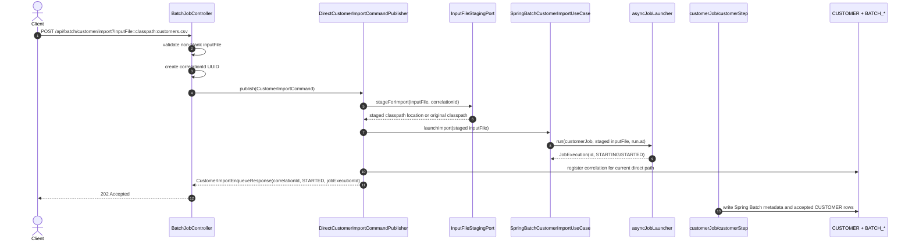
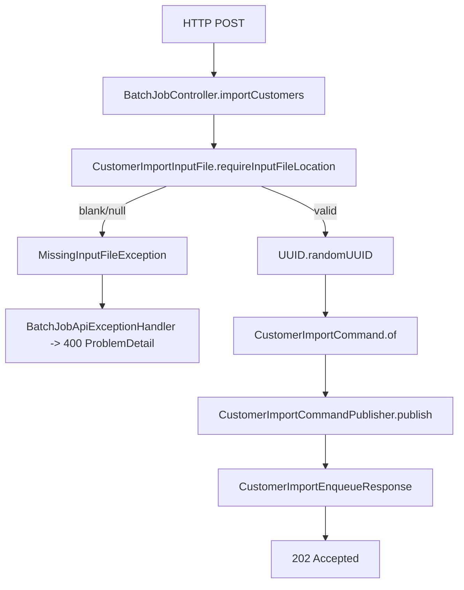
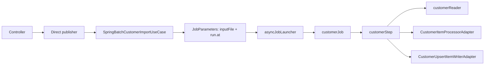
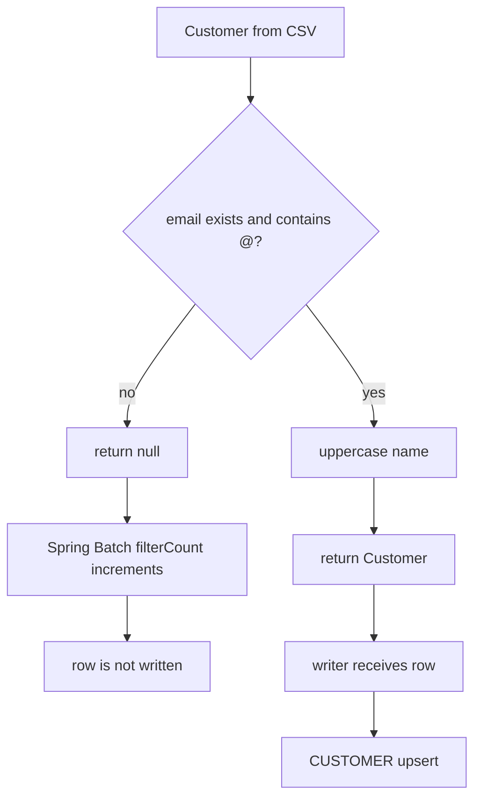
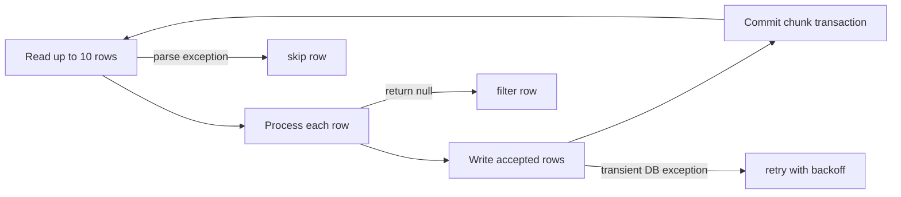
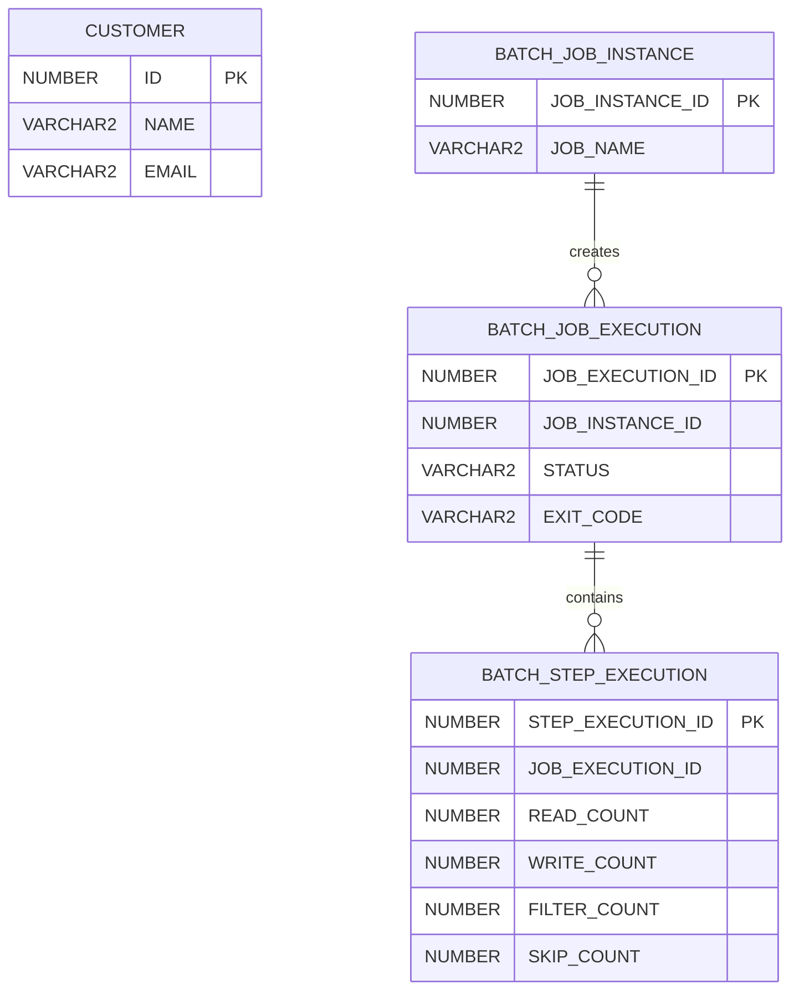
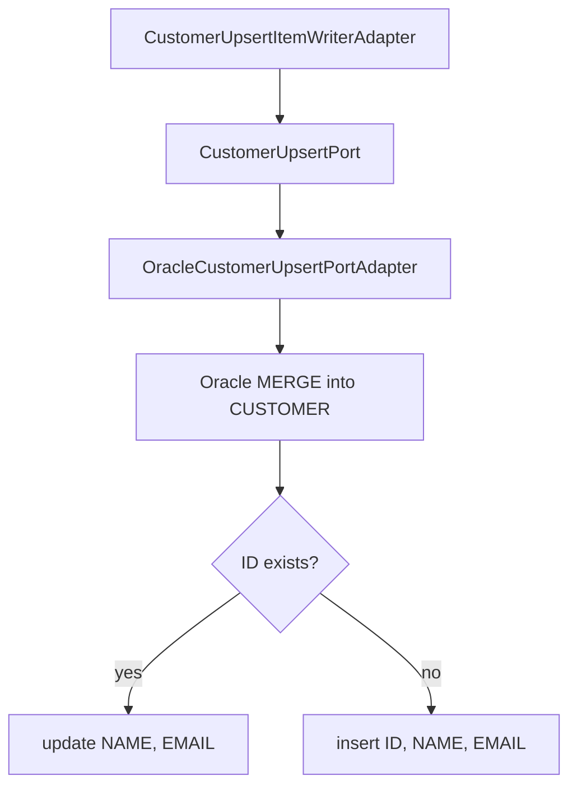
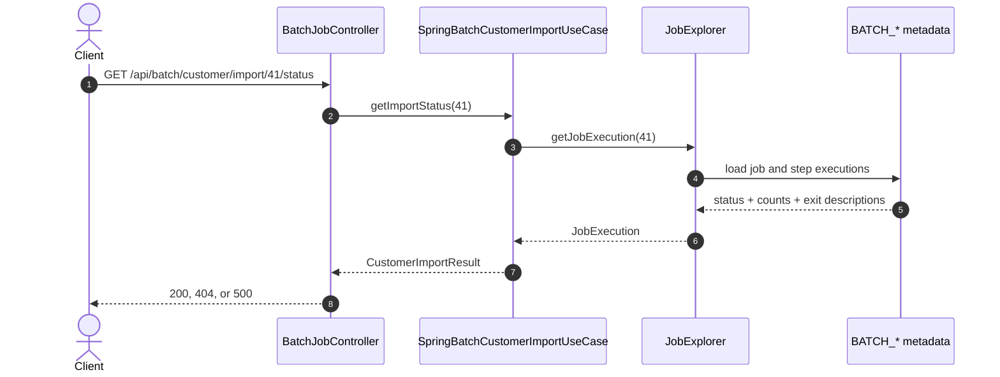
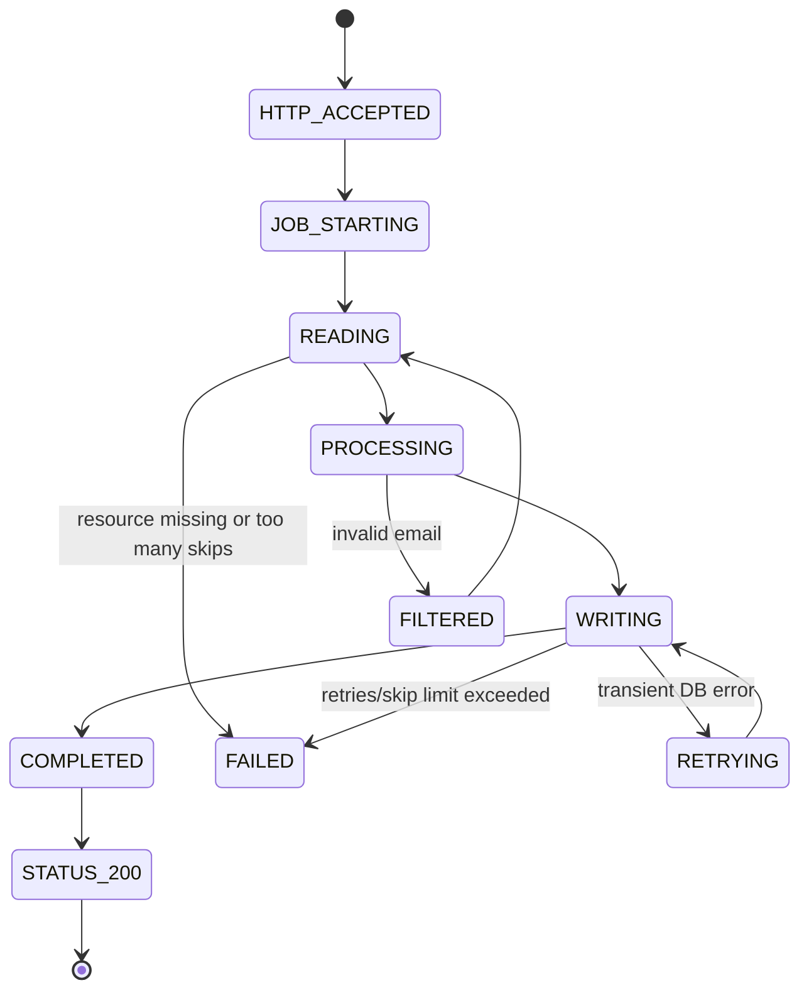

# Phase 1 - core import

Phase 1 is the base customer import capability:

- client submits a CSV resource location
- application launches a Spring Batch job
- reader parses `id,name,email`
- domain policy filters invalid email and uppercases name
- writer upserts accepted rows into `CUSTOMER`
- status endpoint reads Spring Batch metadata

In the current repo, this core flow still exists under all later phases. With RabbitMQ disabled, it is the direct runtime path.

---

# Phase 1 scope

| Included | Not the original Phase 1 concern |
|----------|----------------------------------|
| `POST /api/batch/customer/import` | durable RabbitMQ queueing |
| direct in-process command publisher | DLQ / message retry |
| Spring Batch job/step/chunk processing | per-row audit report endpoint |
| CSV reader and domain policy | persisted rejection detail |
| `CUSTOMER` upsert | correlation polling needed for queued commands |
| `GET /status` for job metadata | full Phase 2 audit browsing |

Later phases add audit/reporting and RabbitMQ around this same core import job.

---

# Endpoint inventory in direct mode

| Request | Direct-mode success | Failure responses |
|---------|---------------------|-------------------|
| `POST /api/batch/customer/import?inputFile=classpath:customers.csv` | `202` with `status=STARTED` and `jobExecutionId` | `400` missing/blank `inputFile`, `500` launch failure |
| `GET /api/batch/customer/import/{jobExecutionId}/status` | `200` with `CustomerImportResult` | `400` non-numeric id, `404` unknown id, `500` if batch status is `FAILED` |

Current code also exposes correlation and report endpoints because later phases exist, but Phase 1 does not require them.

---

# Direct happy path



The controller returns as soon as the job is launched, not when the CSV is fully processed.

---

# Request and response

```http
POST /api/batch/customer/import?inputFile=classpath:customers.csv
```

```json
{
  "correlationId": "2f8f4f22-4c87-48e4-9de9-e53c4f4fe19d",
  "status": "STARTED",
  "jobExecutionId": 41
}
```

Direct mode can return `jobExecutionId` immediately because it launches the job before returning the response.

---

# Controller chain



`BatchJobController` depends on the publisher port, not the direct or AMQP implementation.

---

# Batch launch chain



`run.at` makes each launch a distinct Spring Batch job instance even with the same CSV file.

---

# CSV data contract

The reader expects delimited CSV columns:

```text
id,name,email
1,Alice,alice@example.com
2,Bob,bob@example.com
```

Reader behavior:

- `inputFile` is a Spring resource location such as `classpath:customers.csv` or `file:/tmp/customers.csv`
- `FlatFileItemReader<Customer>` is `@StepScope`
- `inputFile` comes from job parameters at runtime
- fields map to `Customer(id, name, email)`

---

# Row processing rules



Returning `null` from `ItemProcessor` means "filtered", not "failed".

---

# Chunk processing model



The configured chunk size is `10`.

---

# Fault tolerance

| Condition | Spring Batch behavior |
|-----------|-----------------------|
| `TransientDataAccessException` from DB | retry up to 3 times with exponential backoff |
| malformed CSV parse | skip if under skip limit |
| incorrect line length/token count | skip if under skip limit |
| `NumberFormatException` while mapping fields | skip if under skip limit |
| `DataIntegrityViolationException` | skip if under skip limit |
| more than 100 skipped rows | step/job fail |

Backoff starts at `1000ms`, doubles, and caps at `8000ms`.

---

# Phase 1 database model



`CUSTOMER` is application data. `BATCH_*` tables are Spring Batch metadata.

---

# CUSTOMER write



Tests and smoke profiles can replace Oracle writes with `NoOpCustomerUpsertPortAdapter`.

---

# Status polling



Status uses metadata, not `CUSTOMER`, to determine job progress.

---

# Status response

```json
{
  "jobExecutionId": 41,
  "status": "COMPLETED",
  "failures": [],
  "readCount": 1000,
  "writeCount": 980,
  "skipCount": 3,
  "filterCount": 17
}
```

Phase 1 status stays focused on counters and failures. Later phases keep row-level audit in the separate `GET .../report` endpoint.

---

# Exception and HTTP mapping

| Case | Where it happens | Final response |
|------|------------------|----------------|
| missing or blank `inputFile` | input validation | `400` ProblemDetail, title `Missing input file` |
| job launch throws | `SpringBatchCustomerImportUseCase.launchImport` | `500` ProblemDetail, title `Import job launch failed` |
| non-numeric `jobExecutionId` | Spring MVC path binding | `400` ProblemDetail |
| unknown execution id | `JobExplorer.getJobExecution` returns `null` | `404` no body |
| known execution with status `FAILED` | controller status mapping | `500` with `CustomerImportResult` body |
| unexpected controller error | exception handler fallback | `500` ProblemDetail |

---

# Failed job status body

Even when the HTTP status is `500`, the body keeps operational details:

```json
{
  "jobExecutionId": 41,
  "status": "FAILED",
  "failures": [
    "customerStep: org.springframework.batch.item.file.FlatFileParseException: ..."
  ],
  "readCount": 50,
  "writeCount": 40,
  "skipCount": 101,
  "filterCount": 5
}
```

The client can show counts and failure text instead of losing detail behind a generic error.

---

# Happy flow goes ahead where?



Successful POST only confirms launch. Successful job completion is observed later through status polling.

---

# Local Phase 1 style run

Use a no-Rabbit profile for the direct path:

```bash
./mvnw spring-boot:run -Dspring-boot.run.profiles=audit-it
```

Trigger:

```bash
curl -X POST "http://localhost:8080/api/batch/customer/import?inputFile=classpath:customers.csv"
```

Poll:

```bash
curl "http://localhost:8080/api/batch/customer/import/{jobExecutionId}/status"
```

---

# Phase 1 takeaway

The core flow is:

1. REST accepts an `inputFile`.
2. Direct publisher calls the import use case.
3. Spring Batch launches `customerJob`.
4. `customerStep` reads, processes, writes, retries, and skips.
5. `CUSTOMER` receives accepted rows.
6. `BATCH_*` records execution state.
7. status polling reports progress and final result.
