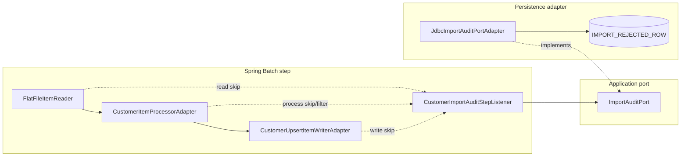
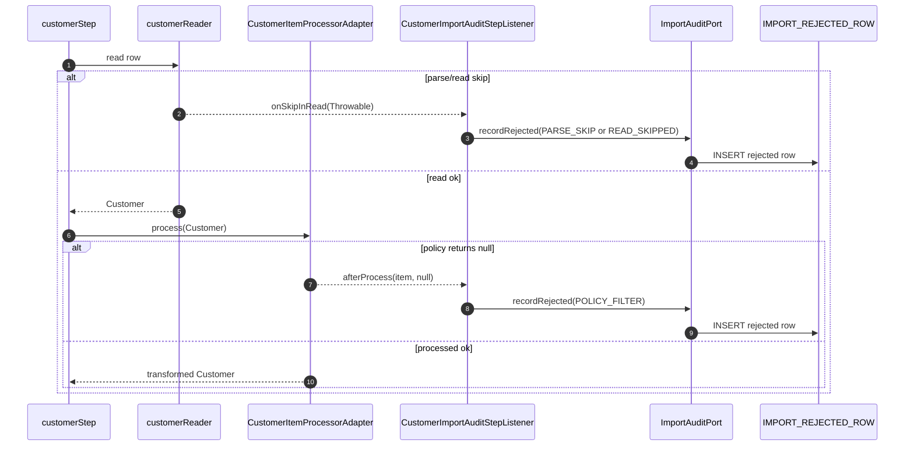
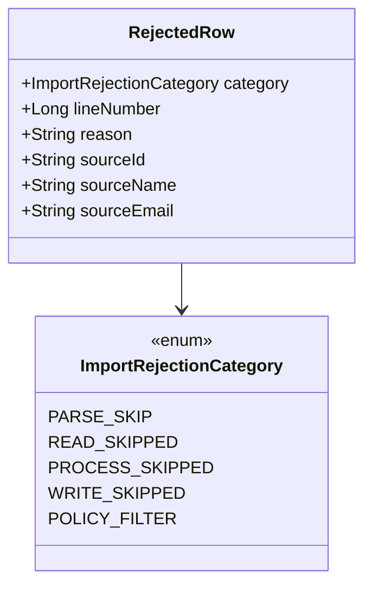
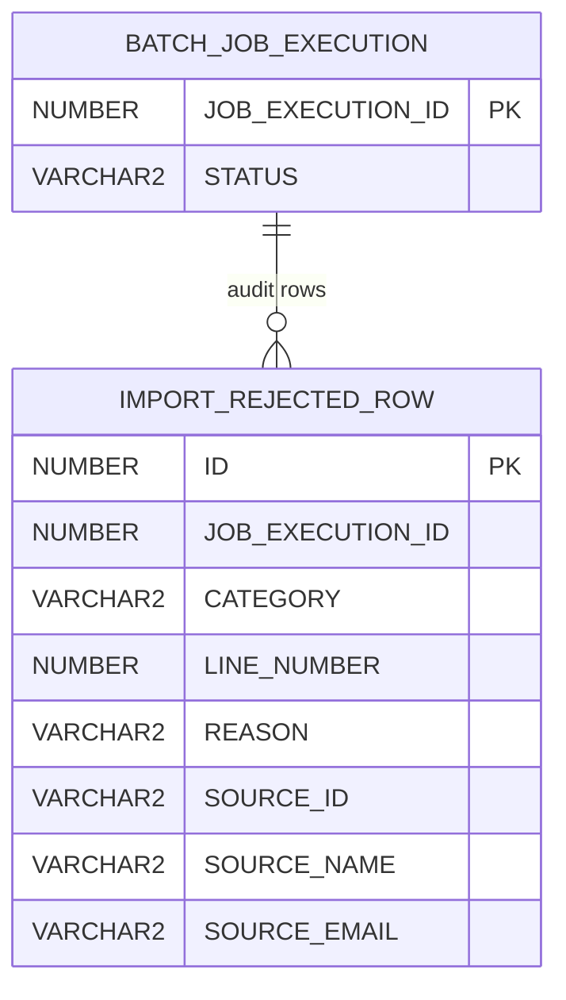
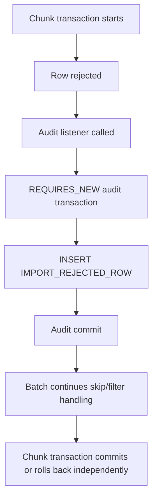
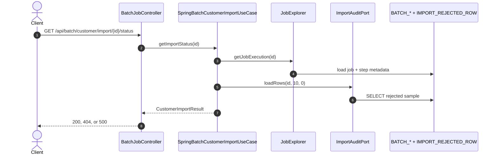
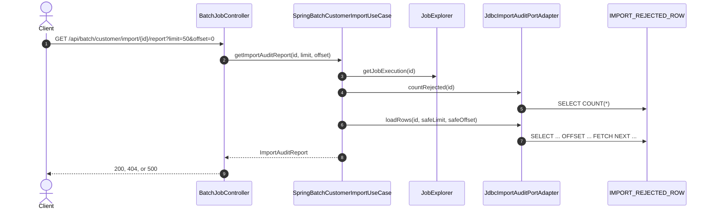
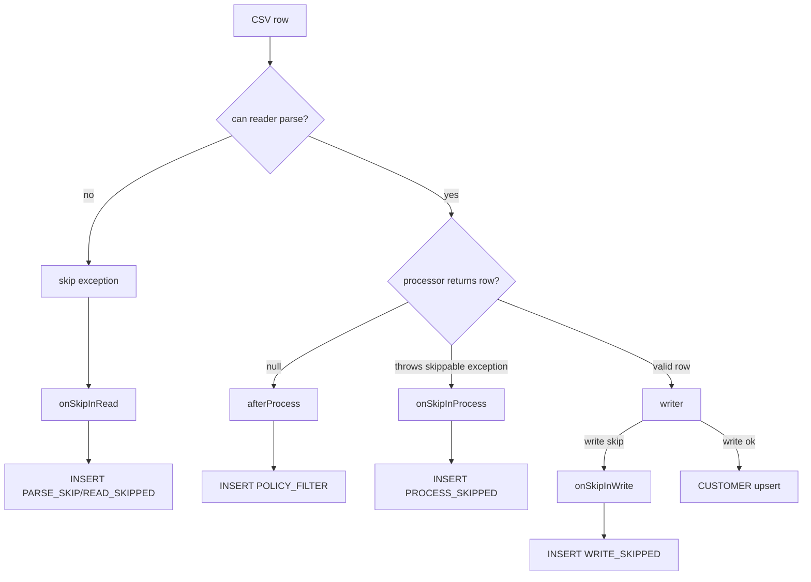

# Phase 2 - audit and reporting

Phase 2 makes rejected input observable.

Instead of only showing aggregate skip/filter counts, the batch step records per-row rejection data into `IMPORT_REJECTED_ROW`, and REST exposes that data through status and report flows.

---

# Phase 2 outcome

| Before | After Phase 2 |
|--------|---------------|
| status had execution counts | status includes counts plus `rejectedSample` |
| invalid email rows only incremented filter count | invalid email rows are persisted as `POLICY_FILTER` |
| parse skips were visible only as skip count/logs | parse skips are persisted with line number and raw input |
| no audit browsing endpoint | `GET /report?limit=&offset=` returns paginated rejected rows |
| no durable explanation for each rejected row | category, line number, reason, and source fields are stored |

---

# Rejection categories

| Category | Source | Meaning |
|----------|--------|---------|
| `PARSE_SKIP` | `onSkipInRead` with `FlatFileParseException` | CSV row could not be parsed |
| `READ_SKIPPED` | `onSkipInRead` with other throwable | read failed and was skipped |
| `PROCESS_SKIPPED` | `onSkipInProcess` | processor threw and row was skipped |
| `WRITE_SKIPPED` | `onSkipInWrite` | writer threw and item was skipped |
| `POLICY_FILTER` | `afterProcess` with `result == null` | domain policy rejected the row without failing the step |

All categories are domain values in `ImportRejectionCategory`.

---

# Phase 2 component map



The listener is infrastructure because it depends on Spring Batch listener APIs.

---

# Chunk hook sequence



Audit happens inside batch lifecycle callbacks, not in the REST controller.

---

# Listener methods

| Method | Trigger | Audit row |
|--------|---------|-----------|
| `onSkipInRead(Throwable)` | reader skip | `PARSE_SKIP` or `READ_SKIPPED` |
| `onSkipInProcess(Customer, Throwable)` | processor exception skip | `PROCESS_SKIPPED` |
| `onSkipInWrite(Customer, Throwable)` | writer exception skip | `WRITE_SKIPPED` |
| `afterProcess(Customer, Customer)` | processor returns `null` | `POLICY_FILTER` |
| `beforeProcess` / `onProcessError` | implemented for interface completeness | no-op |

The listener resolves `jobExecutionId` from `StepSynchronizationManager`.

---

# Audit row data



For parse failures, `sourceEmail` stores truncated raw input because the row could not be mapped to fields.

---

# Database schema



Oracle `schema.sql` creates the table with idempotent PL/SQL blocks. H2 smoke profile uses `schema-h2-import-audit-it.sql`.

---

# Audit insert behavior

| Detail | Current behavior |
|--------|------------------|
| adapter | `JdbcImportAuditPortAdapter` |
| transaction propagation | `REQUIRES_NEW` |
| reason max length | 3800 chars |
| source field max length | 255 chars |
| source id max length | 64 chars |
| insert failure | propagated so the step fails instead of silently dropping audit data |
| report ordering | by audit table `ID` |

`REQUIRES_NEW` isolates audit inserts from the chunk transaction lifecycle, but audit failures are still visible.

---

# Why `REQUIRES_NEW`?



This protects audit rows from normal chunk rollback behavior while still failing fast if audit persistence itself breaks.

---

# Status endpoint in Phase 2



Status is optimized for quick progress plus a small sample, not full audit browsing.

---

# Status response

```json
{
  "jobExecutionId": 41,
  "status": "COMPLETED",
  "failures": [],
  "readCount": 100,
  "writeCount": 95,
  "skipCount": 2,
  "filterCount": 3,
  "rejectedSample": [
    {
      "category": "POLICY_FILTER",
      "lineNumber": 12,
      "reason": "Invalid email: missing @",
      "sourceId": "17",
      "sourceName": "BOB",
      "sourceEmail": "bob.example.com"
    }
  ]
}
```

`rejectedSample` returns up to 10 rows.

---

# Report endpoint



The implementation clamps `limit` to `1..500` and `offset` to `>= 0`.

---

# Report response

```json
{
  "jobExecutionId": 41,
  "jobStatus": "COMPLETED",
  "totalRejectedRows": 5,
  "rows": [
    {
      "category": "PARSE_SKIP",
      "lineNumber": 9,
      "reason": "Incorrect token count",
      "sourceId": null,
      "sourceName": null,
      "sourceEmail": "bad,row,with,too,many,tokens"
    }
  ]
}
```

Report can be queried while the job is still running; the status tells the client whether the list is final.

---

# HTTP response rules

| Endpoint | Condition | Response |
|----------|-----------|----------|
| `POST /customer/import` | missing or blank input | `400` ProblemDetail |
| `POST /customer/import` | direct launch failed | `500` ProblemDetail |
| `GET /status` | unknown job id | `404` |
| `GET /status` | known job failed | `500` with `CustomerImportResult` |
| `GET /status` | known job not failed | `200` with `CustomerImportResult` |
| `GET /report` | unknown job id | `404` |
| `GET /report` | known job failed | `500` with `ImportAuditReport` |
| `GET /report` | known job not failed | `200` with `ImportAuditReport` |

`COMPLETED` with skipped/filtered rows is still HTTP `200`; those rows are business rejects, not API failure.

---

# Count semantics

| Field | Source | Meaning |
|-------|--------|---------|
| `readCount` | `StepExecution.getReadCount()` | rows successfully read/mapped |
| `writeCount` | `StepExecution.getWriteCount()` | rows written by writer |
| `skipCount` | `StepExecution.getSkipCount()` | read/process/write skips |
| `filterCount` | `StepExecution.getFilterCount()` | processor returned `null` |
| `totalRejectedRows` | `IMPORT_REJECTED_ROW` count | persisted audit rows |

`skipCount + filterCount` and `totalRejectedRows` should generally align, but they come from different systems.

---

# Exception branches



Hard failures still fail the job after configured retry/skip policy is exhausted.

---

# Local H2 smoke flow

```bash
./mvnw spring-boot:run -Dspring-boot.run.profiles=audit-it
```

```bash
curl -X POST "http://localhost:8080/api/batch/customer/import?inputFile=classpath:customers-phase2-audit-sample.csv"
```

```bash
curl "http://localhost:8080/api/batch/customer/import/{jobExecutionId}/status"
curl "http://localhost:8080/api/batch/customer/import/{jobExecutionId}/report?limit=50&offset=0"
```

`audit-it` uses H2 Oracle mode and disables RabbitMQ.

---

# Phase 2 takeaway

Phase 2 adds operational visibility without moving business rules out of the domain:

1. Batch callbacks classify rejected rows.
2. Application `ImportAuditPort` describes audit persistence.
3. JDBC adapter writes and reads `IMPORT_REJECTED_ROW`.
4. Status gives a small rejected sample.
5. Report gives paginated rejected rows.
6. HTTP status reflects job existence/failure, not whether individual input rows were rejected.
