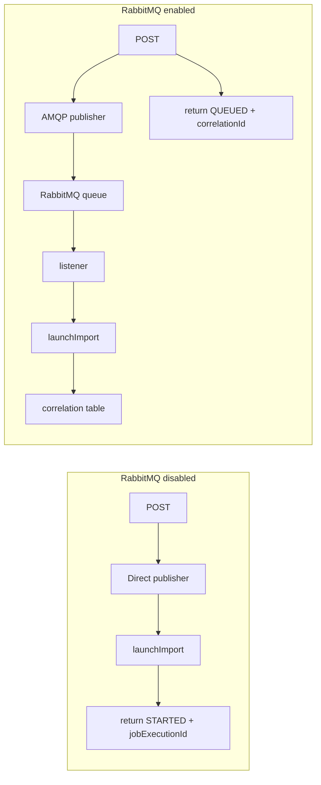
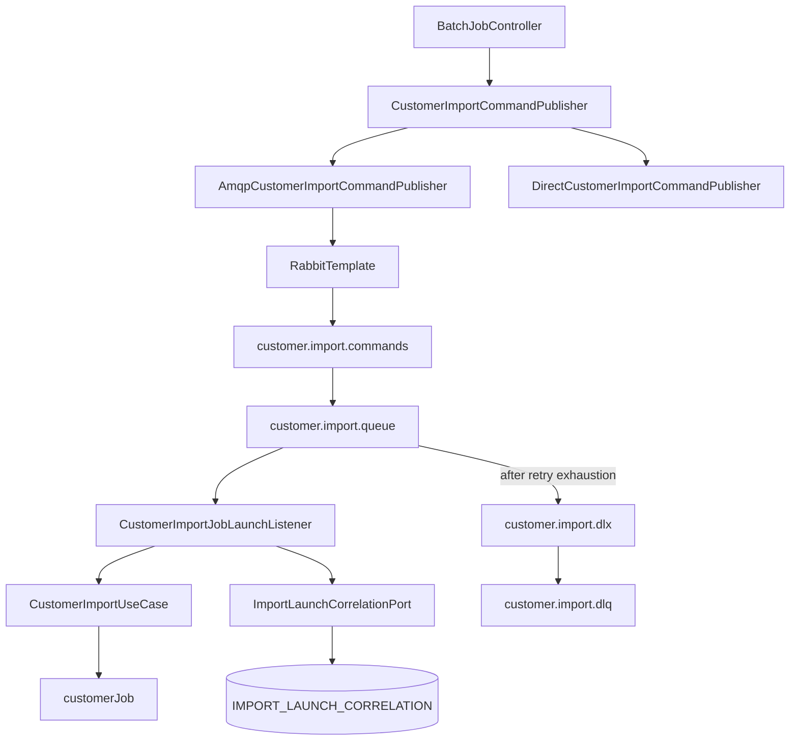
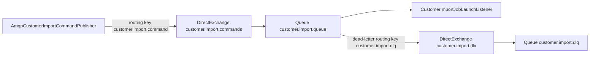
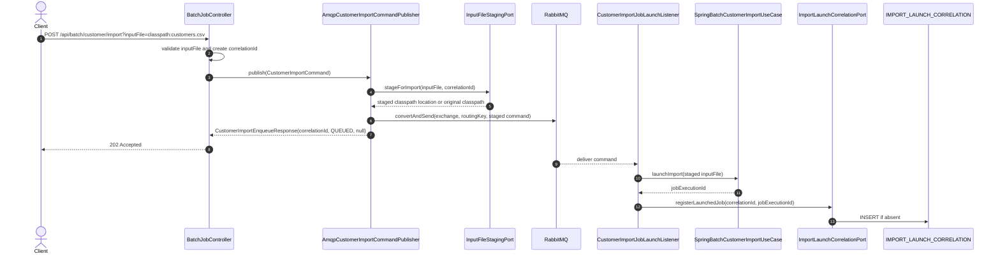
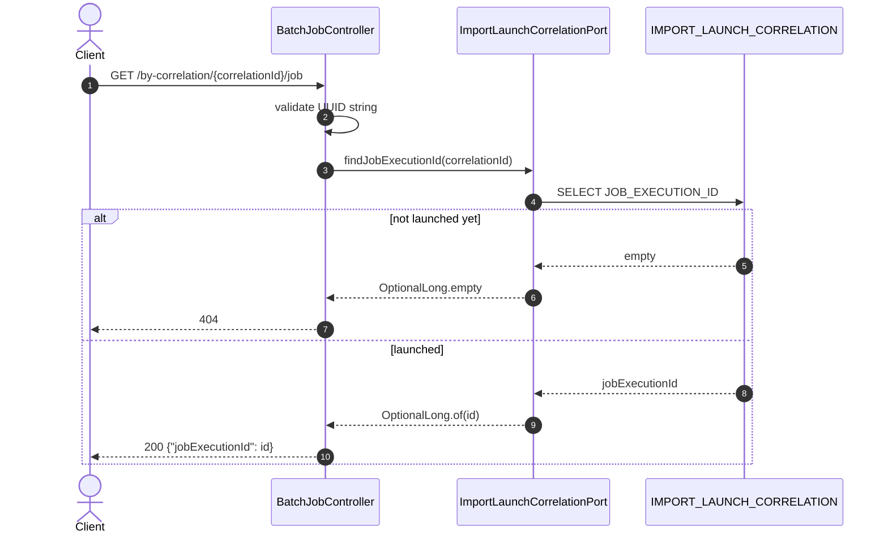
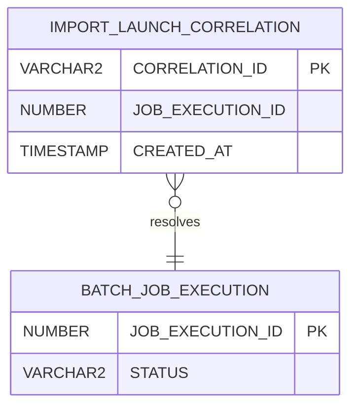
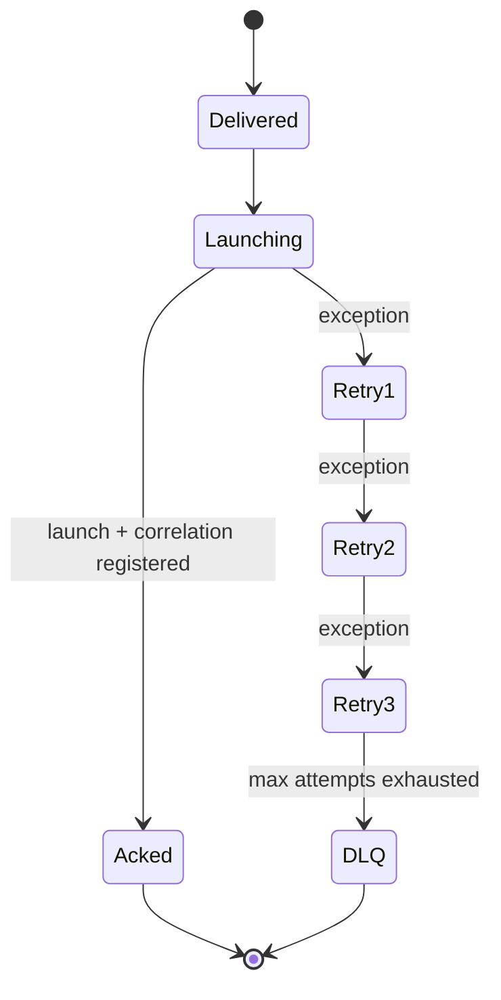

# Phase 3 - RabbitMQ command boundary

Phase 3 changes how imports are accepted.

Instead of launching every import directly from the HTTP request thread, the `dev` profile publishes a command to RabbitMQ and lets a listener launch the Spring Batch job.

---

# Why RabbitMQ here?

| Problem | RabbitMQ contribution |
|---------|----------------------|
| HTTP request should not own all launch work | POST returns after command publish |
| launch should survive short app/request path instability | durable exchange/queue |
| consumers should be controlled | listener concurrency and prefetch |
| repeated listener failures need isolation | retry plus DLQ |
| queued request needs later job id | correlation table |

The batch job itself is unchanged; only the command boundary changes.

---

# Before vs after



Both paths use the same `CustomerImportCommandPublisher` port.

---

# Phase 3 component map



`DirectCustomerImportCommandPublisher` remains the fallback for non-messaging profiles.

---

# RabbitMQ topology



Defaults:

- exchange: `customer.import.commands`
- routing key: `customer.import.command`
- queue: `customer.import.queue`
- dead-letter exchange: `customer.import.dlx`
- dead-letter queue: `customer.import.dlq`

---

# POST sequence in `dev`



The POST response does not contain `jobExecutionId` in the queued path.

---

# Command payload

```json
{
  "correlationId": "2f8f4f22-4c87-48e4-9de9-e53c4f4fe19d",
  "inputFile": "classpath:customers.csv",
  "schemaVersion": 1
}
```

Why include `schemaVersion`:

- lets future consumers reject unsupported messages explicitly
- avoids guessing payload shape when the command evolves
- keeps transport payload separate from HTTP request format

---

# POST response in `dev`

```json
{
  "correlationId": "2f8f4f22-4c87-48e4-9de9-e53c4f4fe19d",
  "status": "QUEUED",
  "jobExecutionId": null
}
```

Client next step:

```http
GET /api/batch/customer/import/by-correlation/2f8f4f22-4c87-48e4-9de9-e53c4f4fe19d/job
```

---

# Correlation lookup



`404` here can mean "not launched yet", not necessarily "bad command".

---

# Correlation table



The JDBC adapter inserts with `INSERT ... SELECT ... WHERE NOT EXISTS` to keep registration idempotent for the same correlation id.

---

# Listener behavior

| Setting | Value / behavior |
|---------|------------------|
| annotation | `@RabbitListener(queues = "${app.messaging.customer-import.queue}")` |
| ack mode | `AUTO` |
| concurrency | `1` |
| prefetch | `1` by default |
| converter | Jackson JSON message converter |
| on success | listener returns and message is acknowledged |
| on repeated failure | retry interceptor exhausts, then message is rejected without requeue |

The queue dead-letters rejected messages to the configured DLX/DLQ.

---

# Retry and DLQ



Default retry settings:

- max attempts: `4`
- initial interval: `1000ms`
- multiplier: `2.0`
- max interval: `10000ms`

---

# Failure branches

| Failure | Where | Final behavior |
|---------|-------|----------------|
| RabbitMQ unavailable during POST | `RabbitTemplate.convertAndSend` | `503` ProblemDetail, title `Import command publish failed` |
| invalid/missing `inputFile` | controller validation | `400` ProblemDetail |
| listener cannot launch job | listener throws `ImportJobLaunchException` | message retry, then DLQ after exhaustion |
| correlation not registered yet | lookup endpoint | `404` |
| invalid correlation id | lookup validation | `400` ProblemDetail |
| launched job later fails | status/report endpoint | `500` with result/report body |

Phase 3 separates "command accepted" from "batch job succeeded".

---

# Profile behavior

| Profile | `app.messaging.customer-import.enabled` | Publisher bean | POST response |
|---------|-----------------------------------------|----------------|---------------|
| `dev` | `true` | `AmqpCustomerImportCommandPublisher` | `QUEUED`, `jobExecutionId=null` |
| `audit-it` | `false` | `DirectCustomerImportCommandPublisher` | `STARTED`, `jobExecutionId` present |
| `test` | `false` | direct/test wiring | direct-style response |
| `amqp-it` | `true` | AMQP publisher/listener | queued-style response |

Spring AMQP auto-configuration is cleared in `application-dev.yaml` so RabbitMQ is active in `dev`.

---

# End-to-end `dev` path

Start infrastructure:

```bash
docker run -d --name oracle-xe \
  -e ORACLE_PASSWORD=oracle123 \
  -e APP_USER=batch_user \
  -e APP_USER_PASSWORD=batch_pass \
  -p 1521:1521 gvenzl/oracle-xe:21-slim
```

RabbitMQ must also be running on `localhost:5672` with `guest/guest`.

Run the app:

```bash
./mvnw spring-boot:run -Dspring-boot.run.profiles=dev
```

---

# End-to-end curl chain

```bash
curl -X POST "http://localhost:8080/api/batch/customer/import?inputFile=classpath:customers.csv"
```

```bash
curl "http://localhost:8080/api/batch/customer/import/by-correlation/{correlationId}/job"
```

```bash
curl "http://localhost:8080/api/batch/customer/import/{jobExecutionId}/status"
```

```bash
curl "http://localhost:8080/api/batch/customer/import/{jobExecutionId}/report?limit=50&offset=0"
```

---

# What stays unchanged from Phases 1 and 2

| Concern | Still handled by |
|---------|------------------|
| CSV parsing | `FlatFileItemReader<Customer>` |
| row policy | `EmailAndNameCustomerImportPolicy` |
| uppercase transform | domain policy |
| customer write | `CustomerUpsertPort` adapter |
| audit rows | `CustomerImportAuditStepListener` and `ImportAuditPort` |
| status/report | `SpringBatchCustomerImportUseCase` and controller |
| batch metadata | Spring Batch `BATCH_*` tables |

RabbitMQ changes how work is accepted, not how the batch job processes rows.

---

# Operational checks

| Check | Why |
|-------|-----|
| RabbitMQ connection | POST needs broker when `dev` messaging is enabled |
| queue depth | queued commands may be waiting for listener |
| DLQ count | repeated listener failures land here |
| `IMPORT_LAUNCH_CORRELATION` rows | confirms listener launched jobs |
| `BATCH_JOB_EXECUTION.STATUS` | source of job state |
| `IMPORT_REJECTED_ROW` count | rejected-row audit health |
| application logs | publish, receive, launch, and completion events |

---

# Phase 3 takeaway

The successful queued flow is:

1. POST validates input and creates `correlationId`.
2. AMQP publisher sends `CustomerImportCommand`.
3. API returns `202 QUEUED`.
4. listener receives command.
5. listener launches the same Spring Batch use case.
6. listener registers `correlationId -> jobExecutionId`.
7. client resolves job id, then polls status/report.
