# Spring Batch flow walkthrough

This is the method-call view of the current codebase.

It follows each request from client to controller, application ports, infrastructure adapters, Spring Batch, and database.

---

# One-page runtime map

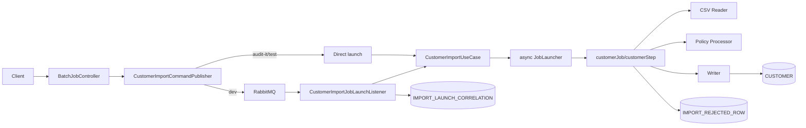

---

# Current endpoints

| Request | Controller method | Response shape |
|---------|-------------------|----------------|
| `POST /api/batch/customer/import?inputFile=...` | `importCustomers` | `CustomerImportEnqueueResponse` |
| `GET /api/batch/customer/import/by-correlation/{uuid}/job` | `getJobExecutionIdByCorrelation` | `{jobExecutionId}` |
| `GET /api/batch/customer/import/{id}/status` | `getImportStatus` | `CustomerImportResult` |
| `GET /api/batch/customer/import/{id}/report` | `getImportAuditReport` | `ImportAuditReport` |

---

# POST import - controller chain

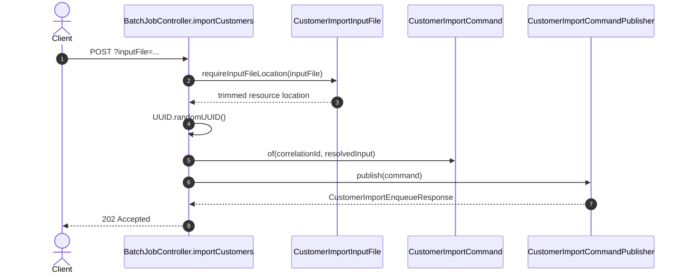

---

# Publisher branch detail

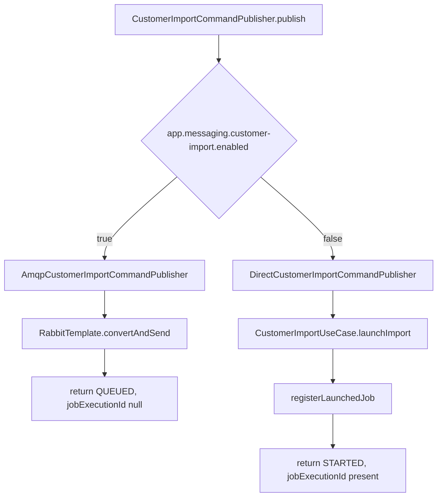

---

# RabbitMQ listener chain

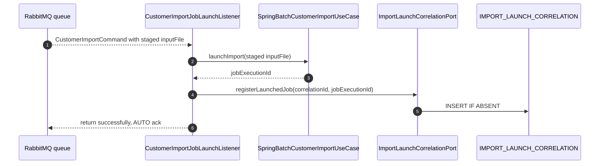

---

# Batch launch chain

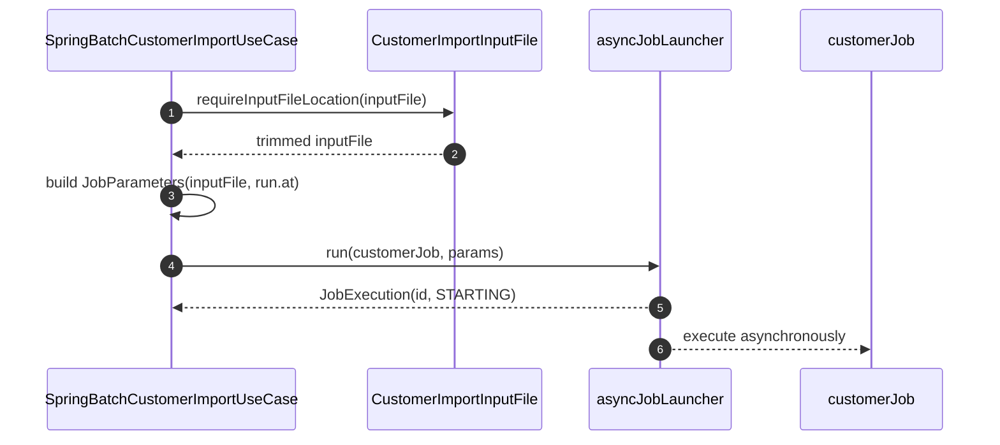

---

# Batch read/process/write chain

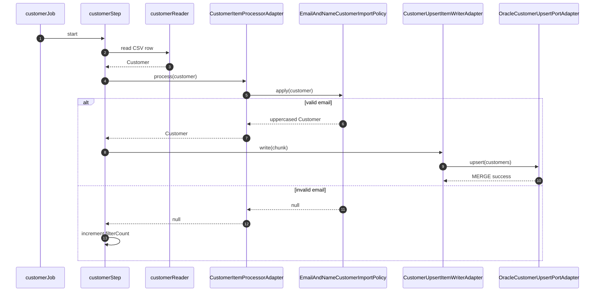

---

# Audit branch inside batch

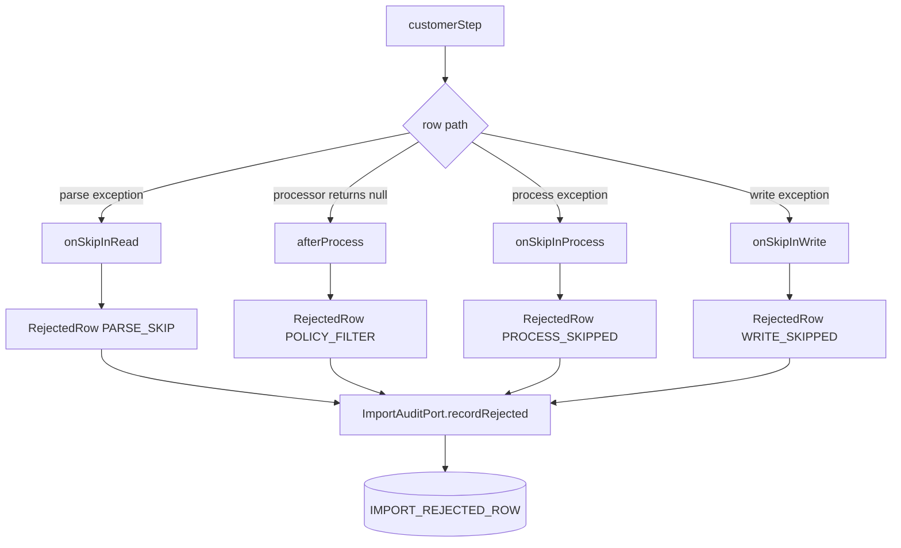

---

# Correlation lookup flow

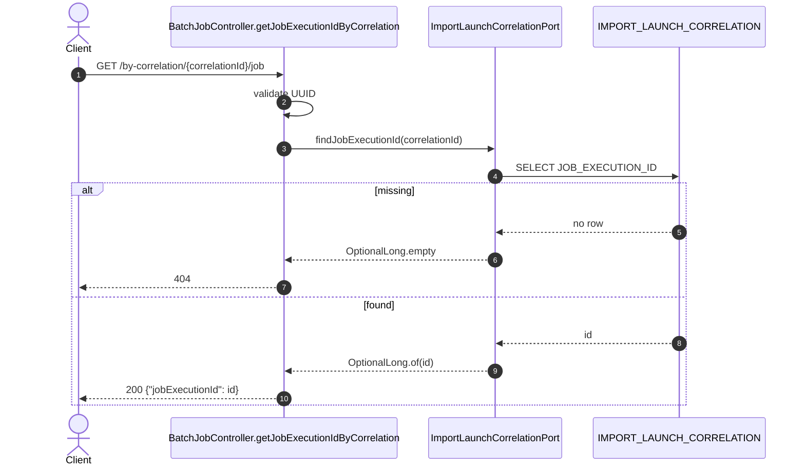

---

# Status flow

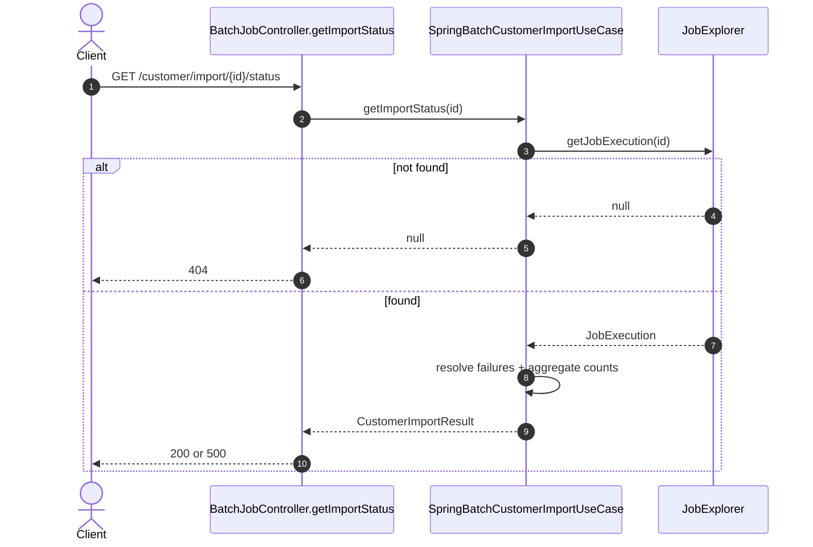

---

# Report flow

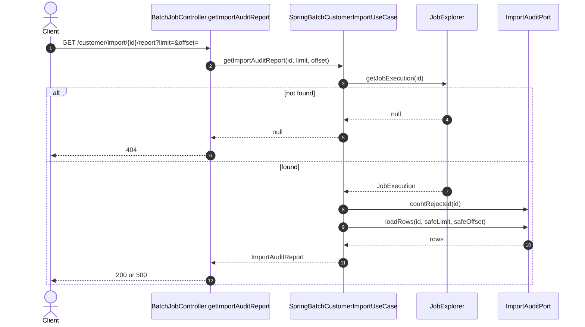

---

# DB tables by flow

| Flow | Table touched | Why |
|------|---------------|-----|
| batch metadata | `BATCH_*` | Spring Batch job/step state |
| customer writer | `CUSTOMER` | upsert valid customers |
| audit listener | `IMPORT_REJECTED_ROW` | persist rejected rows |
| correlation registration | `IMPORT_LAUNCH_CORRELATION` | map HTTP correlation id to job id |
| status/report | `BATCH_*`, `IMPORT_REJECTED_ROW` | read progress and audit |

---

# Response matrix

| Scenario | HTTP |
|----------|------|
| POST accepted by RabbitMQ | `202 QUEUED` |
| POST accepted by direct launcher | `202 STARTED` |
| POST missing `inputFile` | `400 ProblemDetail` |
| Rabbit publish fails | `500 ProblemDetail` |
| correlation id invalid | `400 ProblemDetail` |
| correlation not launched yet | `404` |
| status/report unknown job | `404` |
| status/report failed job | `500` with JSON body |
| status/report non-failed job | `200` with JSON body |

---

# Job lifecycle

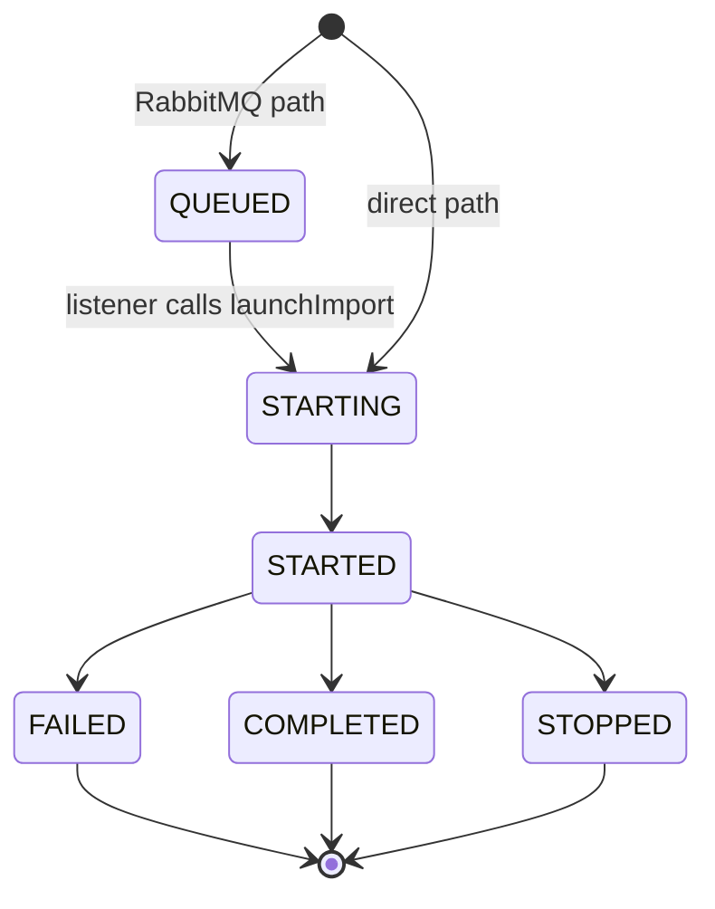

---

# Method chain summary

POST:

`BatchJobController.importCustomers` -> `CustomerImportInputFile` -> `CustomerImportCommandPublisher` -> AMQP or direct publisher -> `CustomerImportUseCase.launchImport`

Batch:

`customerJob` -> `customerStep` -> reader -> processor -> policy -> writer -> DB + audit listener

Polling:

controller -> use case -> `JobExplorer` + audit port -> DTO -> HTTP response mapping
