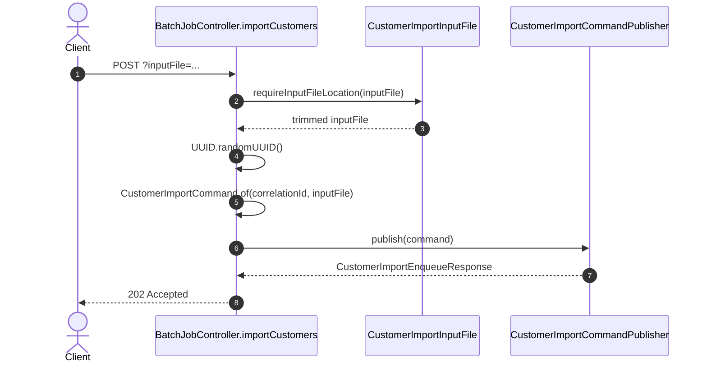
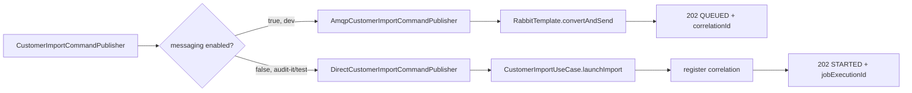
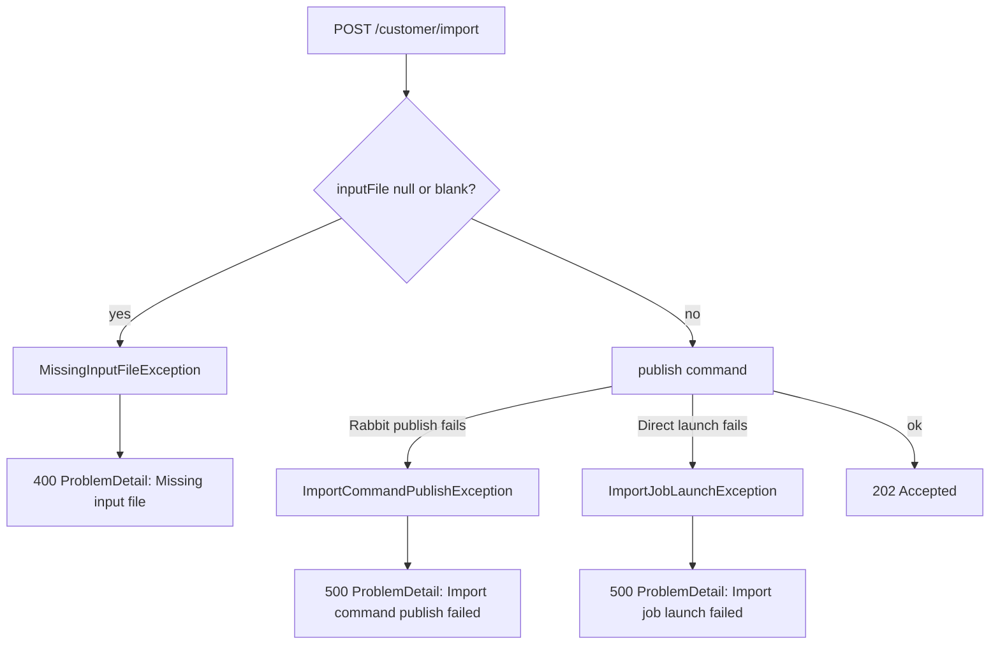
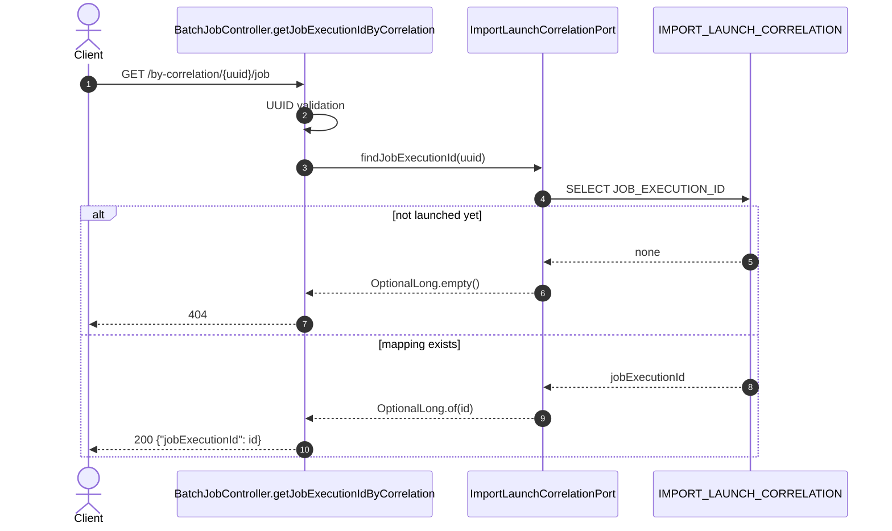
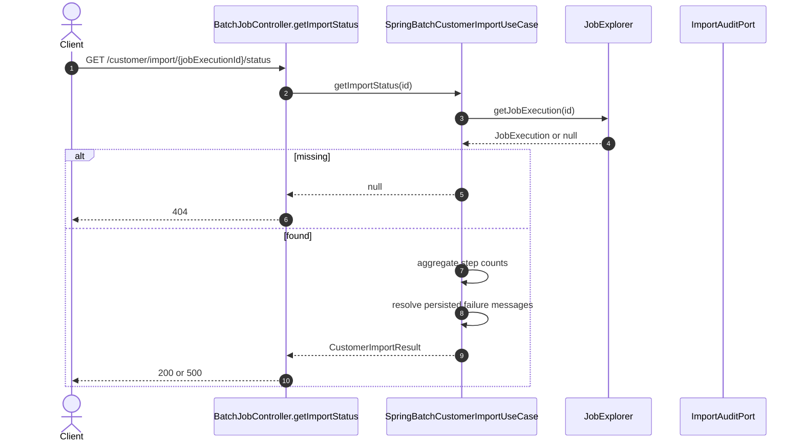
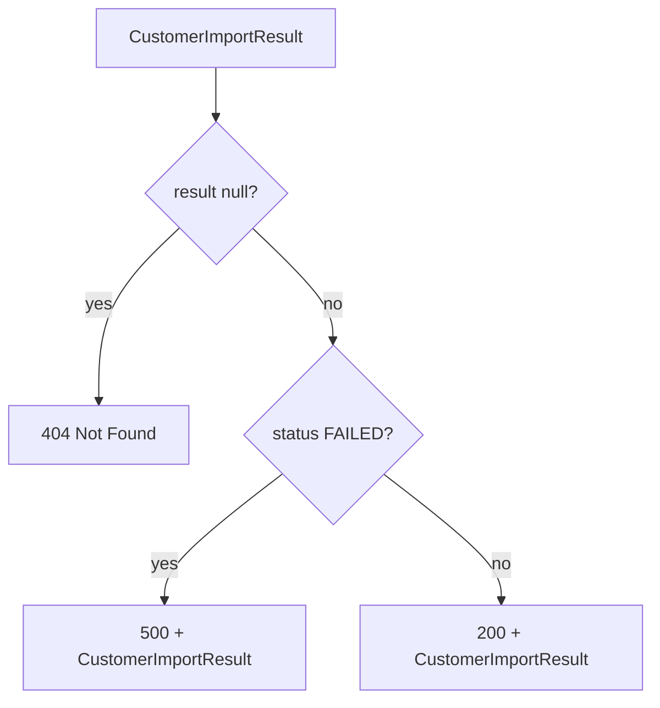
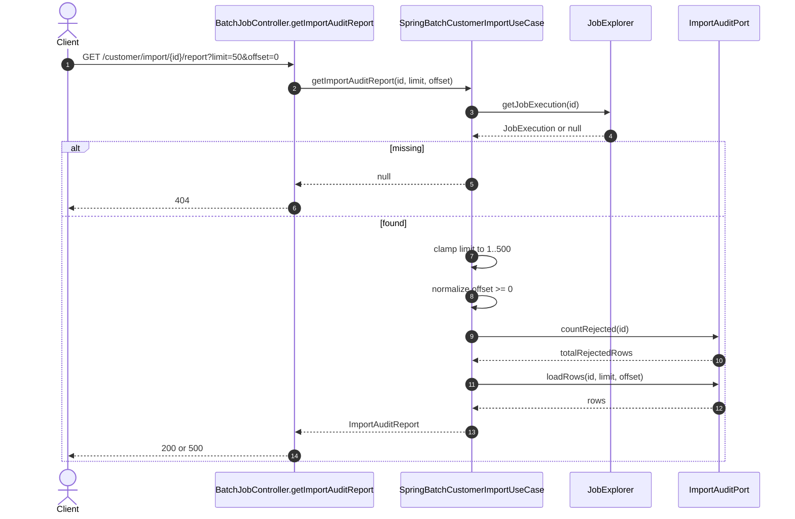
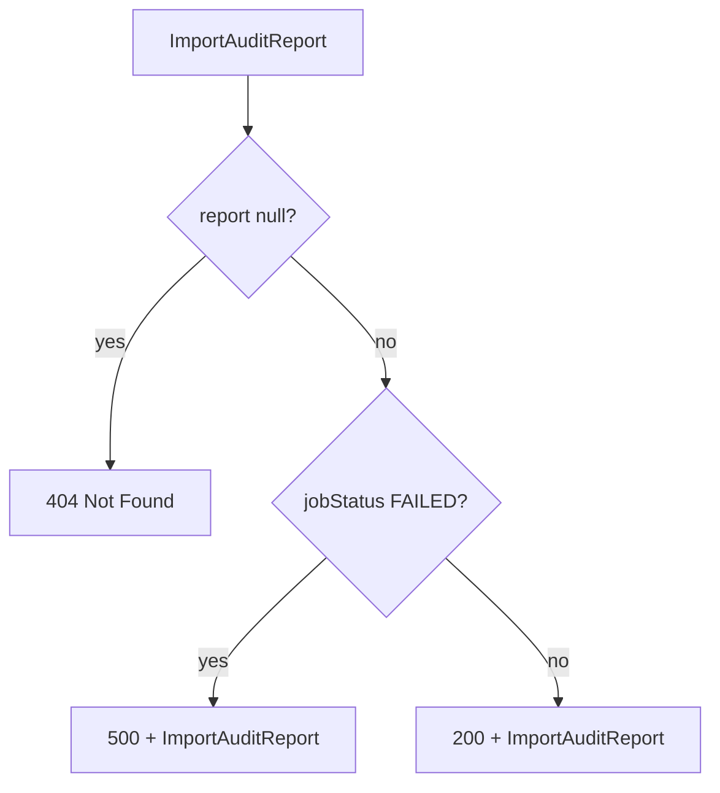
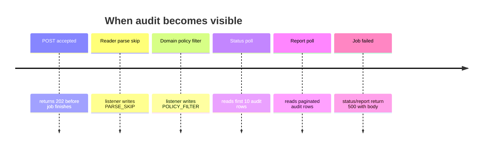

# Phase 2 HTTP flows

This deck answers:

- what request is sent
- which controller method is hit
- what downstream method is called
- what response is returned
- when audit rows become visible

---

# Endpoint inventory

| Endpoint | Method | Controller method | Main output |
|----------|--------|-------------------|-------------|
| `/api/batch/customer/import` | `POST` | `importCustomers` | `CustomerImportEnqueueResponse` |
| `/api/batch/customer/import/by-correlation/{id}/job` | `GET` | `getJobExecutionIdByCorrelation` | `{jobExecutionId}` |
| `/api/batch/customer/import/{id}/status` | `GET` | `getImportStatus` | `CustomerImportResult` |
| `/api/batch/customer/import/{id}/report` | `GET` | `getImportAuditReport` | `ImportAuditReport` |

---

# POST flow - common start



The concrete publisher depends on profile/config.

---

# Publisher branch



---

# POST response bodies

RabbitMQ path:

```json
{
  "correlationId": "c6b4...",
  "status": "QUEUED",
  "jobExecutionId": null
}
```

Direct path:

```json
{
  "correlationId": "c6b4...",
  "status": "STARTED",
  "jobExecutionId": 42
}
```

---

# POST failures



---

# Correlation lookup



---

# Status flow



---

# Status response mapping



---

# Report flow



---

# Report response mapping



---

# Audit timing



---

# Flow table

| Scenario | Final response |
|----------|----------------|
| POST valid, Rabbit path | `202 QUEUED`, no `jobExecutionId` yet |
| POST valid, direct path | `202 STARTED`, includes `jobExecutionId` |
| POST missing input | `400 ProblemDetail` |
| correlation not registered yet | `404` |
| status/report unknown job id | `404` |
| status/report failed batch job | `500` with JSON body |
| status/report running or completed | `200` with JSON body |

---

# Curl chain

```bash
# 1. Accept work
curl -s -X POST \
  "http://localhost:8080/api/batch/customer/import?inputFile=classpath:customers-phase2-audit-sample.csv"

# 2. If POST returned QUEUED, resolve job id
curl -s "http://localhost:8080/api/batch/customer/import/by-correlation/<uuid>/job"

# 3. Poll status
curl -s "http://localhost:8080/api/batch/customer/import/<jobExecutionId>/status" | jq .

# 4. Fetch full report
curl -s "http://localhost:8080/api/batch/customer/import/<jobExecutionId>/report?limit=20&offset=0" | jq .
```

---

# Read this deck with code

| Slide concept | Code anchor |
|---------------|-------------|
| POST flow | `BatchJobController.importCustomers` |
| direct vs Rabbit branch | `DirectCustomerImportCommandPublisher`, `AmqpCustomerImportCommandPublisher` |
| status/report build | `SpringBatchCustomerImportUseCase` |
| audit insert/read | `JdbcImportAuditPortAdapter` |
| row categories | `ImportRejectionCategory`, `RejectedRow` |
