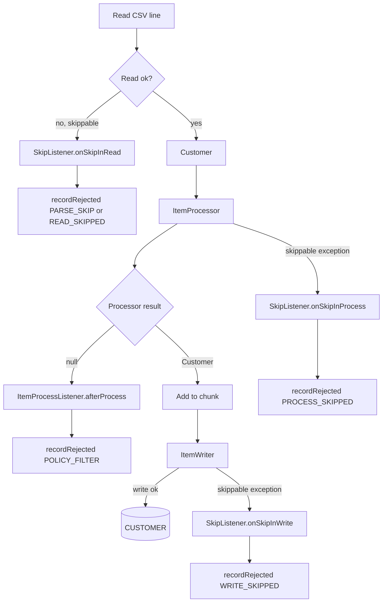
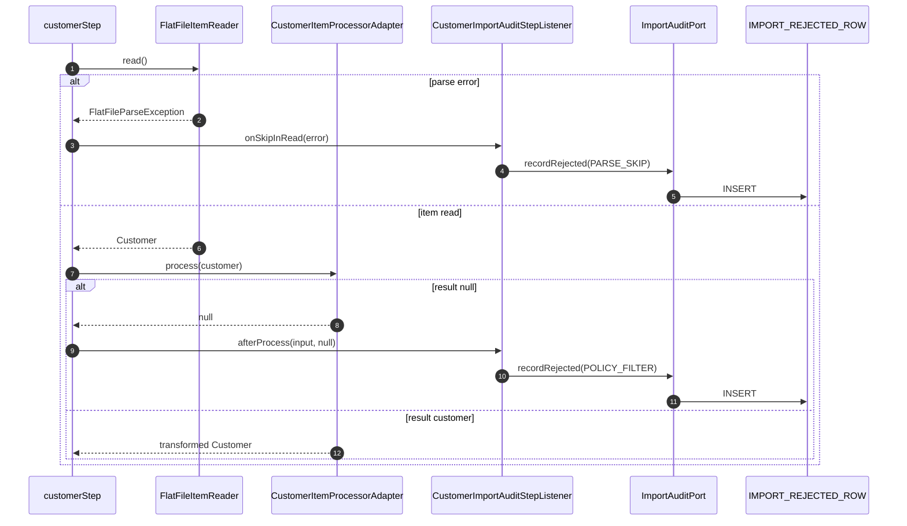
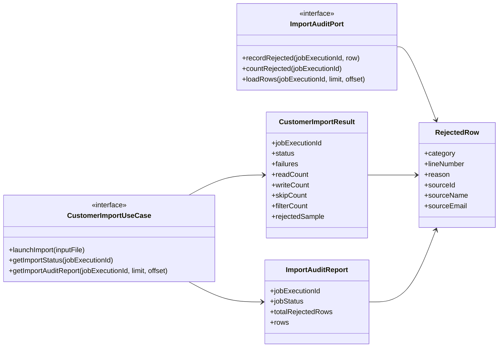
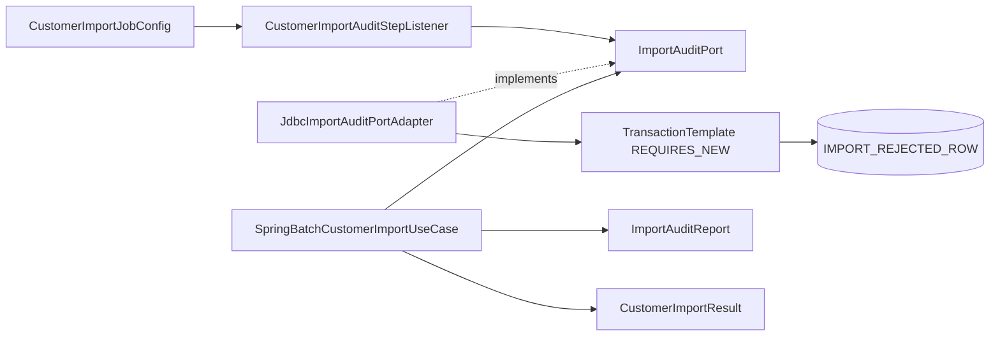
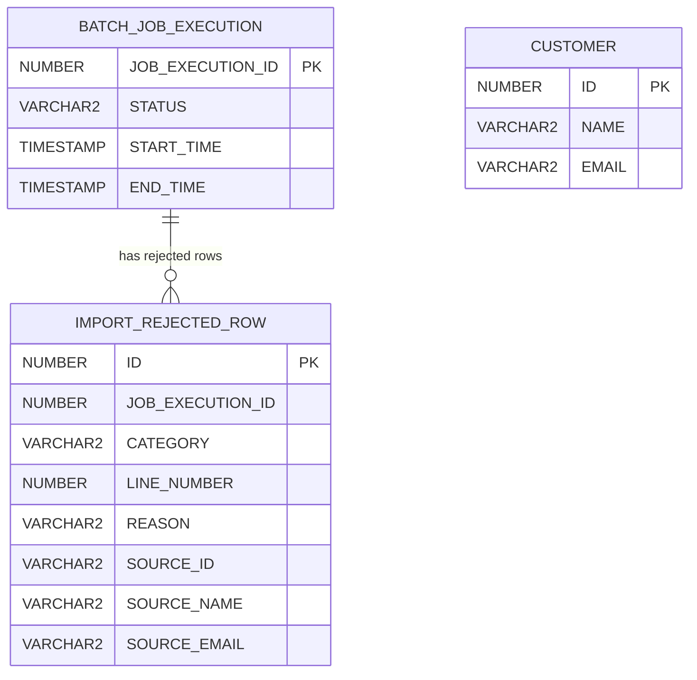
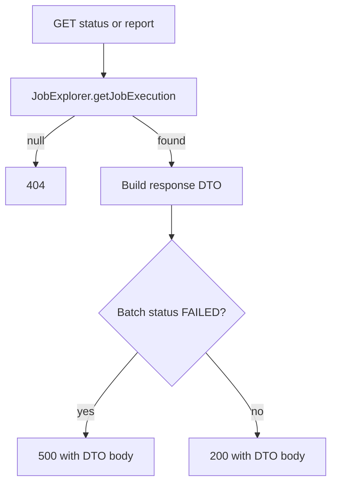

# Phase 2 - audit & reporting

Phase 1 told us how many rows were read, written, skipped, or failed.

Phase 2 answers the next operational question:

**Which rows were rejected, and why?**

---

# Phase 2 outcome

| Area | Added in Phase 2 |
|------|------------------|
| Domain | `RejectedRow`, `ImportRejectionCategory` |
| Application | `ImportAuditPort`, `ImportAuditReport`, `filterCount`, `rejectedSample` |
| Infrastructure | `CustomerImportAuditStepListener`, `JdbcImportAuditPortAdapter` |
| Batch config | skip/process listeners wired to `customerStep` |
| DB | `IMPORT_REJECTED_ROW` |
| API | `GET /api/batch/customer/import/{id}/report` |
| Smoke | `audit-it` H2 profile |

---

# Rejection categories

| Category | Captured by | Why it matters |
|----------|-------------|----------------|
| `PARSE_SKIP` | `onSkipInRead` for `FlatFileParseException` | CSV line could not become `Customer` |
| `READ_SKIPPED` | `onSkipInRead` for other read exceptions | reader-level skip |
| `PROCESS_SKIPPED` | `onSkipInProcess` | processor exception |
| `WRITE_SKIPPED` | `onSkipInWrite` | write/upsert exception |
| `POLICY_FILTER` | `afterProcess(input, null)` | business rule rejected row |

`POLICY_FILTER` is a filter, not a Spring Batch skip.

---

# Chunk loop with audit hooks



---

# Listener sequence



---

# Application contracts



---

# Infrastructure adapters



The listener writes audit rows. The use case reads them for status and report APIs.

---

# Why `REQUIRES_NEW`?

Rejected-row audit is inserted using a separate transaction.

That makes the audit write independent from normal chunk transaction boundaries.

If audit insert fails, the code intentionally does **not** swallow it:

- operator visibility is part of the contract
- silent audit loss would be worse than a failed import
- schema/permission mistakes surface quickly

---

# Database schema



Oracle DDL lives in `schema.sql`. H2 smoke DDL lives in `schema-h2-import-audit-it.sql`.

---

# Status endpoint

`GET /api/batch/customer/import/{jobExecutionId}/status`

```json
{
  "jobExecutionId": 1,
  "status": "COMPLETED",
  "failures": [],
  "readCount": 4,
  "writeCount": 2,
  "skipCount": 1,
  "filterCount": 1,
  "rejectedSample": []
}
```

Use this for dashboards and quick progress checks.

---

# Report endpoint

`GET /api/batch/customer/import/{jobExecutionId}/report?limit=50&offset=0`

```json
{
  "jobExecutionId": 1,
  "jobStatus": "COMPLETED",
  "totalRejectedRows": 2,
  "rows": [
    {
      "category": "POLICY_FILTER",
      "lineNumber": 2,
      "reason": "Row filtered by import policy: email is missing or invalid (must contain '@').",
      "sourceId": "2",
      "sourceName": "Bob",
      "sourceEmail": "bademail"
    }
  ]
}
```

Use this for row-level investigation.

---

# HTTP response rules



The body stays parseable on `500`, so clients can still inspect partial audit evidence.

---

# Count semantics

| Field | Meaning |
|-------|---------|
| `readCount` | rows successfully converted to `Customer` |
| `writeCount` | processed items written to the writer |
| `skipCount` | Spring Batch skippable exceptions |
| `filterCount` | processor returned `null` |
| `rejectedSample` | first 10 persisted audit rows |
| `totalRejectedRows` | all audit rows for the job |

Read failures can increase `skipCount` without increasing `readCount`.

---

# Local H2 smoke

```bash
./mvnw spring-boot:run -Dspring-boot.run.profiles=audit-it

curl -s -X POST \
  "http://localhost:8080/api/batch/customer/import?inputFile=classpath:customers-phase2-audit-sample.csv"

curl -s "http://localhost:8080/api/batch/customer/import/1/status" | jq .

curl -s "http://localhost:8080/api/batch/customer/import/1/report?limit=20&offset=0" | jq .
```

`audit-it` uses H2 and a no-op customer writer, so it exercises REST + batch + audit without Oracle.

---

# Verification

| Check | Purpose |
|-------|---------|
| `./mvnw clean verify` | full automated suite |
| `CustomerImportBatchAuditIntegrationTest` | batch + audit + H2 integration |
| `CustomerImportAuditStepListenerTest` | listener category mapping |
| Web MVC tests | HTTP mapping for status/report |
| manual `audit-it` smoke | end-to-end curl proof |

---

# What Phase 2 enables

Phase 2 creates the visibility layer needed before durable messaging:

- background jobs can be inspected after HTTP returns
- rejected rows are explainable
- operators can distinguish malformed input from domain policy rejection
- Phase 3 can safely queue work because reporting is already available
