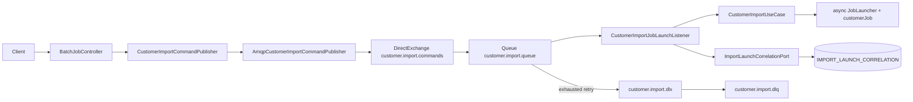
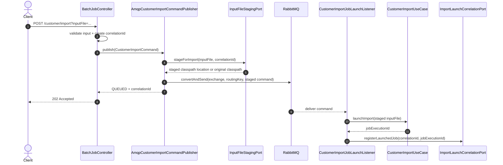
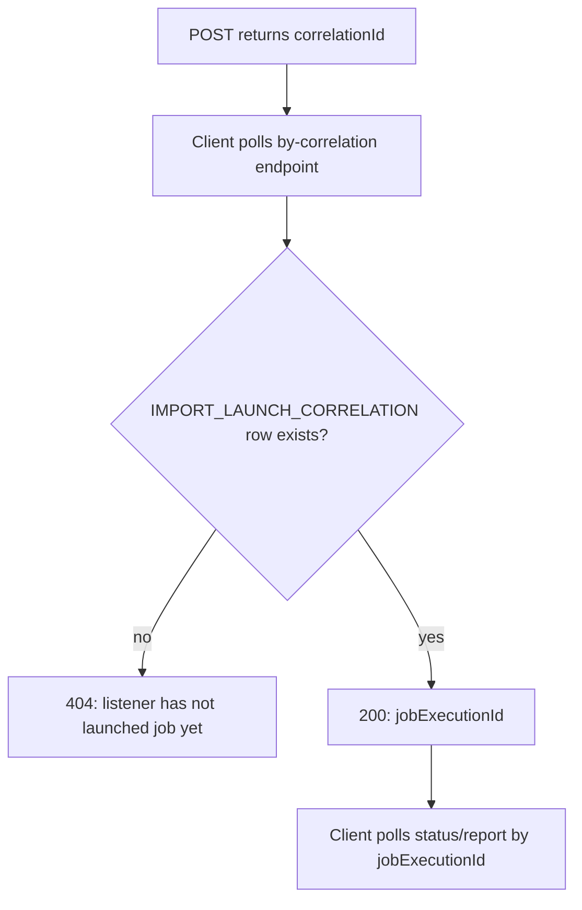
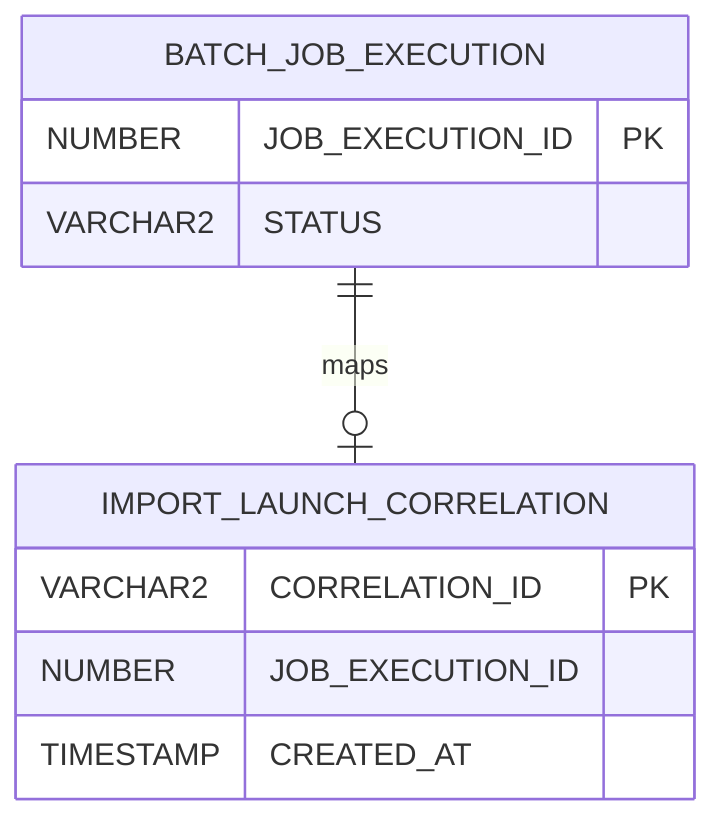
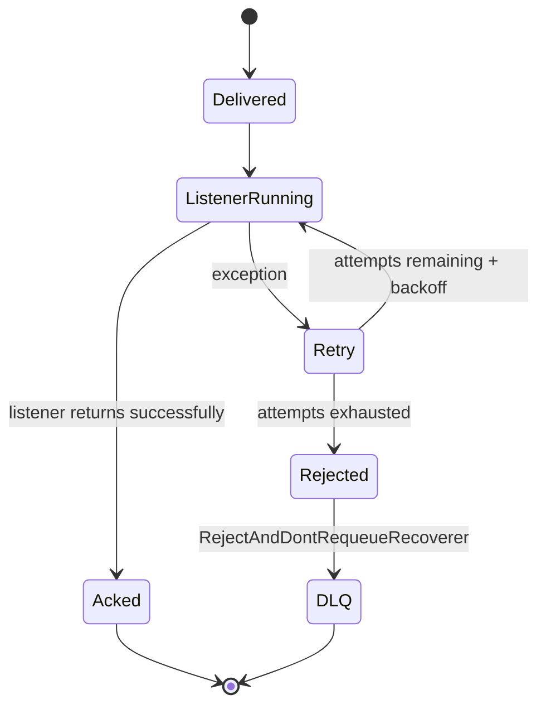
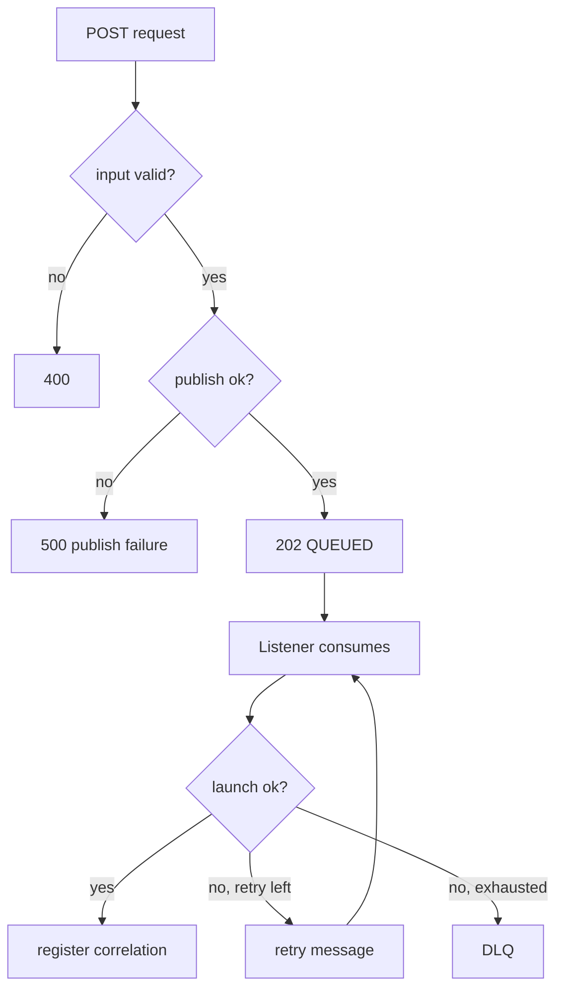

# Phase 3 - RabbitMQ boundary

Phase 3 moves the HTTP-to-batch handoff behind a durable message boundary.

The API no longer needs to start the batch job before returning in `dev`.

---

# Why RabbitMQ here?

- absorbs bursts of import requests
- makes accepted work durable outside the HTTP request
- gives operators a DLQ for poison messages
- decouples caller latency from batch launch latency
- keeps batch chunk retry separate from message-level retry

---

# Before vs after

| Step | Phase 1/2 direct launch | Phase 3 `dev` |
|------|--------------------------|---------------|
| POST | calls launcher path in-process | publishes command to RabbitMQ |
| 202 body | usually has `jobExecutionId` | has `correlationId`, status `QUEUED` |
| job id | known immediately | known after listener launches job |
| retry boundary | batch chunk retry | message retry + batch chunk retry |
| failed message | HTTP failure | message can reach DLQ |

---

# Component map



---

# Topology

| Piece | Default value |
|-------|---------------|
| Exchange | `customer.import.commands` |
| Routing key | `customer.import.command` |
| Work queue | `customer.import.queue` |
| DLX | `customer.import.dlx` |
| DLQ | `customer.import.dlq` |
| DLQ routing key | `customer.import.dlq` |

Declared by `CustomerImportRabbitConfig` when `app.messaging.customer-import.enabled=true`.

---

# POST sequence in `dev`



---

# Command payload

```json
{
  "correlationId": "6f60f76d-cfd9-4e6f-9dcf-2e6d2b9d9bb1",
  "inputFile": "classpath:customers-phase2-audit-sample.csv",
  "schemaVersion": 1
}
```

`schemaVersion` gives room for message evolution without breaking old consumers.

---

# Correlation lookup



---

# Correlation table



Insert is "if absent" so redelivery does not create duplicate mappings.

---

# Retry and DLQ



Message retry is separate from Spring Batch chunk retry.

---

# Listener tuning

| Setting | Default |
|---------|---------|
| Prefetch | `1` |
| Listener concurrency | `1` |
| Retry max attempts | `4` |
| Initial interval | `1000ms` |
| Multiplier | `2.0` |
| Max interval | `10000ms` |
| Recoverer | `RejectAndDontRequeueRecoverer` |

---

# Profile behavior

| Profile | Publisher bean | POST status | Needs RabbitMQ? |
|---------|----------------|-------------|-----------------|
| `dev` | `AmqpCustomerImportCommandPublisher` | `QUEUED` | yes |
| default | `DirectCustomerImportCommandPublisher` | `STARTED` | no |
| `audit-it` | direct publisher | `STARTED` | no |
| `test` | direct or mocked path | test-specific | no |
| `amqp-it` | AMQP path | `QUEUED` | Testcontainers |

---

# End-to-end `dev` curl path

```bash
# 1. Start RabbitMQ and Oracle first
docker compose -f docker-compose.rabbitmq.yml up -d

# 2. Run app
./mvnw spring-boot:run -Dspring-boot.run.profiles=dev

# 3. POST import
curl -s -X POST \
  "http://localhost:8080/api/batch/customer/import?inputFile=classpath:customers-phase2-audit-sample.csv"

# 4. Resolve job id
curl -s "http://localhost:8080/api/batch/customer/import/by-correlation/<uuid>/job"
```

---

# Operational checks

| Check | Where |
|-------|-------|
| command published | RabbitMQ exchange/queue metrics |
| stuck command | `customer.import.queue` depth |
| poison message | `customer.import.dlq` depth |
| job launched | `IMPORT_LAUNCH_CORRELATION` |
| job progress | `BATCH_JOB_EXECUTION`, status endpoint |
| row rejections | `IMPORT_REJECTED_ROW`, report endpoint |

---

# Failure branches



---

# What stays unchanged

RabbitMQ only changes the launch boundary.

These stay the same:

- `CustomerImportUseCase.launchImport`
- `customerJob` / `customerStep`
- reader / processor / writer
- audit listener and report API
- status endpoint once `jobExecutionId` is known

---

# Next hardening ideas

- expose DLQ replay tooling
- add correlation id to all structured logs
- add Micrometer metrics for queue depth, launch latency, DLQ count
- add idempotency policy for repeated `inputFile`
- move DDL to Flyway/Liquibase
