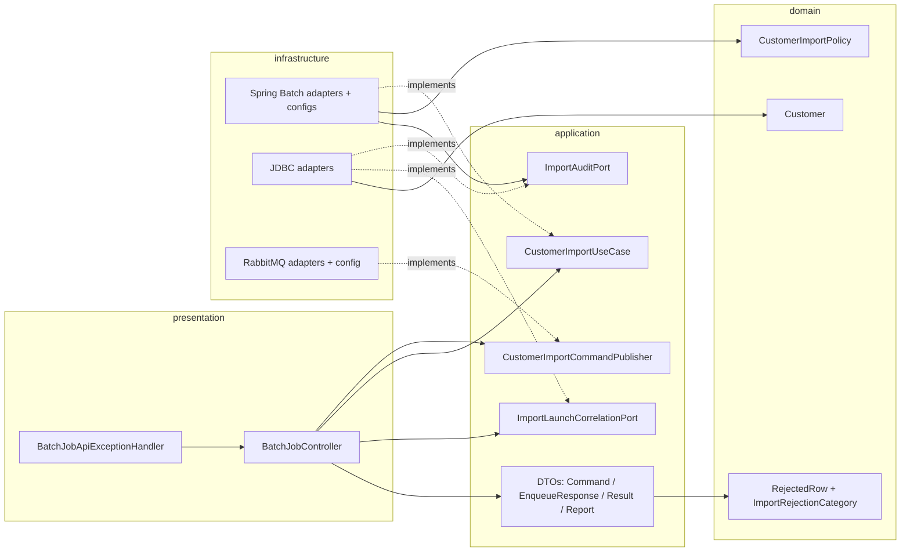
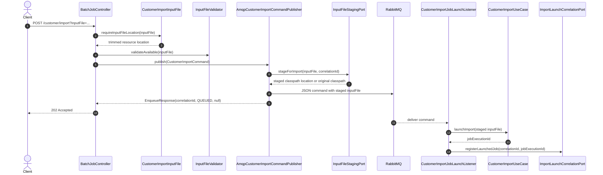
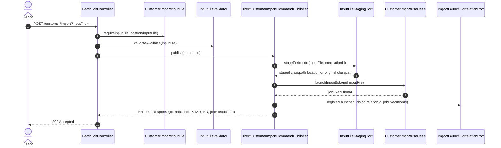
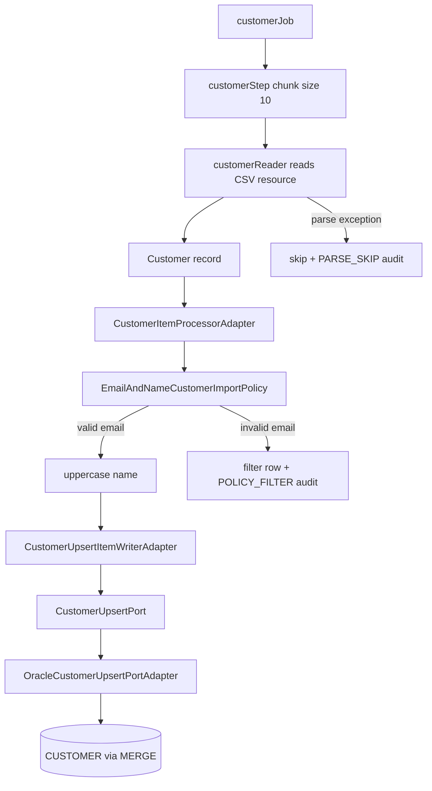
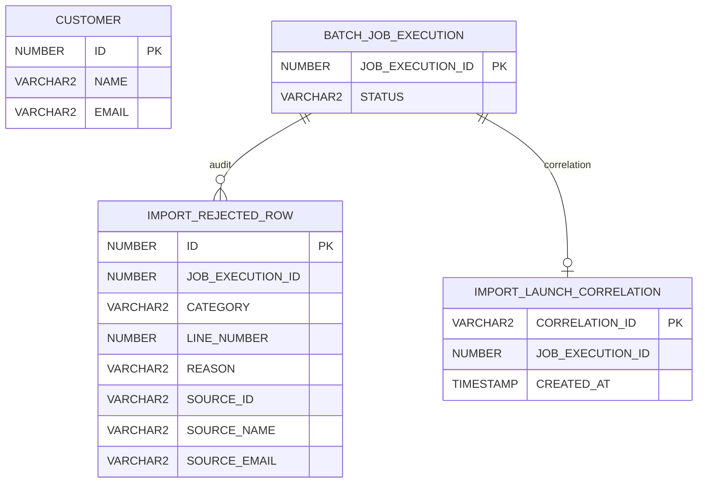
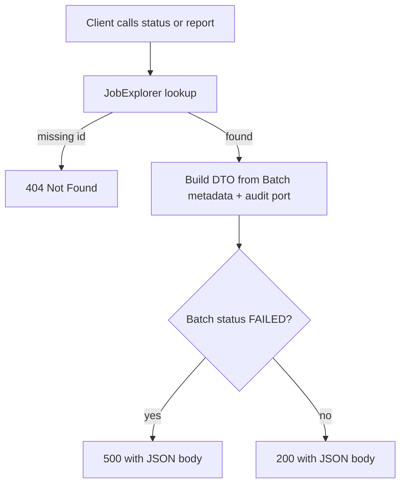

# Spring Batch customer import

CSV input becomes `Customer` rows, valid rows are upserted into `CUSTOMER`, and rejected rows are recorded for audit.

This deck is the high-level map:

- REST entry points and response semantics
- Onion layer boundaries
- RabbitMQ vs in-process launch
- Batch read/process/write flow
- Audit/reporting and DB tables

---

# Current capability snapshot

| Capability | Current behavior |
|------------|------------------|
| Import trigger | `POST /api/batch/customer/import?inputFile=...` |
| Async boundary | RabbitMQ in `dev`; direct in-process launch in `audit-it` / `test` |
| Status | `GET /api/batch/customer/import/{jobExecutionId}/status` |
| Audit report | `GET /api/batch/customer/import/{jobExecutionId}/report?limit=&offset=` |
| Correlation lookup | `GET /api/batch/customer/import/by-correlation/{correlationId}/job` |
| Persistence | Oracle `MERGE` for customers; audit rows in `IMPORT_REJECTED_ROW` |

---

# Onion layers



Dependency rule: presentation and infrastructure depend inward on application/domain contracts; domain has no Spring/JDBC/Batch types.

---

# Runtime modes

| Profile | Messaging | Database | Customer writer | Use case |
|---------|-----------|----------|-----------------|----------|
| default | off | Oracle config, no schema init | Oracle MERGE | safer prod-like defaults |
| `dev` | RabbitMQ on | Oracle XE | Oracle MERGE | full Phase 3 path |
| `audit-it` | off | H2 Oracle mode | no-op customer upsert | fast REST + batch + audit smoke |
| `test` | off | H2 Oracle mode | test wiring/mocks | automated tests |
| `amqp-it` | on | H2 Oracle mode | no-op customer upsert | AMQP integration tests |

---

# Endpoint map

| Request | Success | Important failures |
|---------|---------|--------------------|
| `POST /customer/import?inputFile=...` | `202` + `CustomerImportEnqueueResponse` | `400` missing/blank/unreadable input, `500` launch failure, `503` publish failure |
| `GET /customer/import/by-correlation/{uuid}/job` | `200` + `{jobExecutionId}` | `400` invalid UUID, `404` not launched yet |
| `GET /customer/import/{id}/status` | `200` + `CustomerImportResult` | `404` unknown id, `500` if batch `FAILED` |
| `GET /customer/import/{id}/report?limit=&offset=` | `200` + `ImportAuditReport` | `404` unknown id, `500` if batch `FAILED` |

---

# POST in `dev`: RabbitMQ path



---

# POST in `audit-it`: direct path



---

# Batch execution



---

# Fault tolerance and audit hooks

| Event | Spring Batch behavior | Audit behavior |
|-------|-----------------------|----------------|
| Invalid email | processor returns `null`, increments `filterCount` | `POLICY_FILTER` row |
| Malformed CSV | skippable read exception, increments `skipCount` | `PARSE_SKIP` row |
| Process skip | skippable processor exception | `PROCESS_SKIPPED` row |
| Write skip | skippable writer exception | `WRITE_SKIPPED` row |
| Transient DB issue | retry up to 3 times with exponential backoff | no audit unless ultimately skipped/failed |

---

# Database model



---

# Status vs report

`GET .../status` is the quick operational view:

- `status`
- `failures`
- `readCount`, `writeCount`, `skipCount`, `filterCount`
- no row-level audit sample; use `GET .../report` for persisted rejected rows

`GET .../report` is the detailed row-level view:

- `jobStatus`
- `totalRejectedRows`
- paginated `RejectedRow` list

---

# Response mapping



The `500` body is still useful: clients can parse counts and audit rows even when the job failed.

---

# Run paths

```bash
# Full dev path: Oracle + RabbitMQ required
./mvnw spring-boot:run -Dspring-boot.run.profiles=dev

# Fast local smoke: H2 + no RabbitMQ + no Oracle MERGE
./mvnw spring-boot:run -Dspring-boot.run.profiles=audit-it

# Test suite
./mvnw clean verify
```

---

# Deck guide

| Deck | Use when |
|------|----------|
| `slides.md` | you need the whole system in one pass |
| `slides-phase2.md` | audit/reporting design deep dive |
| `slides-phase2-flows.md` | status/report HTTP behavior only |
| `slides-phase3.md` | RabbitMQ command boundary |
| `flows.md` | method-call and runtime-flow walkthrough |
