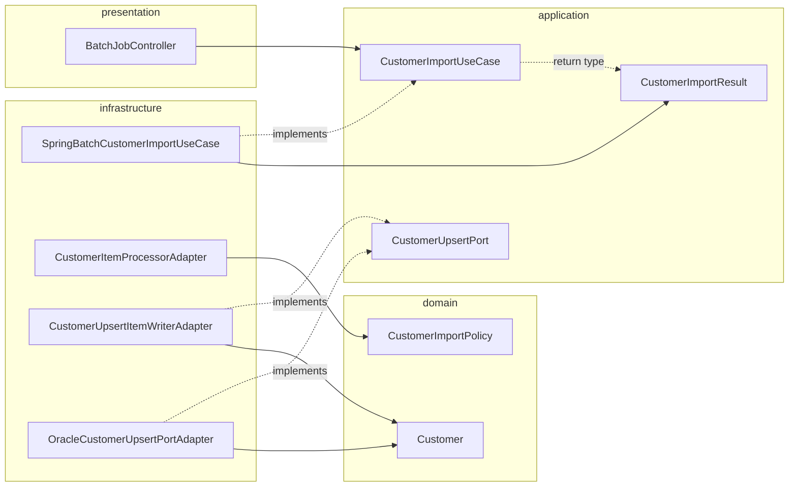

# Spring Batch customer import

**What:** CSV → validate / transform → Oracle `CUSTOMER` (MERGE upsert).

**Why demo:** Onion boundaries + fault-tolerant chunk step + async API.

<!-- Async keeps HTTP from blocking; batch owns throughput and retries. -->

---

# Spring Batch (60s)

- **Job** → **Step** (chunk): **read** → **process** → **write**
- **Fault tolerance:** retry transient DB errors; skip bad CSV lines
- **Metadata:** `BATCH_*` tables (`JobExplorer` for polling)

---

# Onion — who owns what

| Layer | Owns |
|-------|------|
| **Domain** | `Customer`, `CustomerImportPolicy` (no Spring) |
| **Application** | `CustomerImportUseCase`, `CustomerImportResult`, `CustomerUpsertPort` |
| **Infrastructure** | Batch configs, adapters, JDBC MERGE, async `JobLauncher` |
| **Presentation** | `BatchJobController` — HTTP only |

Dependencies point **inward** (controllers → application → domain; infra **implements** ports).

---

# Compile-time dependencies (Mermaid)



<!-- IMPL implements the use-case interface; it constructs CustomerImportResult — contract, not an illegal upward call into a domain service. -->

---

# `Customer` vs `CustomerImportResult`

| | `Customer` | `CustomerImportResult` |
|---|------------|------------------------|
| **Package** | `domain.customer` | `application.customer` |
| **Meaning** | Business row | Job / polling view (`jobExecutionId`, `status`, counts, `failures`) |
| **Batch** | Item in chunk | Returned by `getImportStatus` |

---

# Runtime (happy path)

1. `POST /api/batch/customer/import` → **202** + `{ jobExecutionId }`
2. Async `JobLauncher` runs `customerJob` / `customerStep`
3. `GET .../import/{id}/status` → **200** + progress until `COMPLETED`

---

# REST API (current)

- `POST /api/batch/customer/import?inputFile=` — required `classpath:` / `file:` resource (400 if missing/blank)
- `GET /api/batch/customer/import/{jobExecutionId}/status` — `readCount` / `writeCount` / `skipCount` / **`filterCount`** + **`rejectedSample`**
- `GET /api/batch/customer/import/{jobExecutionId}/report?limit=&offset=` — paginated **`IMPORT_REJECTED_ROW`** audit (`ImportAuditReport`)
- **HTTP (status + report):** **404** unknown id; **500** when batch `FAILED` (body still JSON); **200** otherwise (including `COMPLETED` with warnings in `failures` on status)

---

# Faults & polling

- **Retry:** `TransientDataAccessException` (bounded + backoff)
- **Skip:** malformed CSV (`FlatFileParseException`) → persisted **`PARSE_SKIP`** audit rows
- **Filter:** policy returns `null` → **`filterCount`** + **`POLICY_FILTER`** audit rows
- **`failures`:** from persisted **exit descriptions** (not in-memory only) — survives `JobExplorer` reload

---

# Run & test

```bash
./mvnw clean verify
./mvnw spring-boot:run -Dspring-boot.run.profiles=dev
```

- Tests: **H2** `MODE=Oracle` — no Docker Oracle required
- Dev: **Oracle XE** + `application-dev.properties`

See `RUNBOOK.md` for Docker and JDBC URLs.

---

# What to improve next

- Phase 3: RabbitMQ command path (`ROADMAP.md`)
- Optional `CustomerSourcePort` (abstract CSV)
- CI (GitHub Actions) for `./mvnw clean verify`

---

# Phase 2 deck

Deep dive on **audit + reporting**: **`slides-phase2.md`** — `npm run dev:phase2` / `npm run build:phase2` (output **`dist-phase2/`**).
